## Contents
{:.no_toc}

-   [Identification data.frame](#identification-data.frame)
-   [Keeping all matches](#keeping-all-matches)
-   [Filtering data](#filtering-data)
-   [Adding identification data to raw
    data](#adding-identification-data-to-raw-data)
-   [An identification-annotated
    chromatogram](#an-identification-annotated-chromatogram)
-   [Visualising peptide-spectrum
    matches](#visualising-peptide-spectrum-matches)
-   [Comparing spectra](#comparing-spectra)
-   [Summary exercise](#summary-exercise)
-   [Exploration and Assessment of Identifications using
    `MSnID`](#exploration-and-assessment-of-identifications-using-msnid)
    -   [Step-by-step work-flow](#step-by-step-work-flow)
    -   [Analysis of peptide sequences](#analysis-of-peptide-sequences)
    -   [Trimming the data](#trimming-the-data)
    -   [Parent ion mass errors](#parent-ion-mass-errors)
    -   [Filtering criteria](#filtering-criteria)
    -   [Setting filters](#setting-filters)
    -   [Filter optimisation](#filter-optimisation)
    -   [Export `MSnID` data](#export-msnid-data)
{:toc} \# Identification data {#sec-id}

Peptide identification is performed using third-party software - there
is no package to run these searches directly in R. When using line
search engines it possible to hard-code or automatically generate the
search command lines and run them from R using a `system()` call. This
allows to generate these reproducibly (especially useful if many command
lines need to be run) and to keep a record in the R script of the exact
command.

The example below illustrates this for 3 mzML files to be searched using
`MSGFplus`:

    (mzmls <- paste0("file_", 1:3, ".mzML"))

    ## [1] "file_1.mzML" "file_2.mzML" "file_3.mzML"

    (mzids <- sub("mzML", "mzid", mzmls))

    ## [1] "file_1.mzid" "file_2.mzid" "file_3.mzid"

    paste0("java -jar /path/to/MSGFPlus.jar",
           " -s ", mzmls,
           " -o ", mzids,
           " -d uniprot.fas",
           " -t 20ppm",
           " -m 0",
           " int 1")

    ## [1] "java -jar /path/to/MSGFPlus.jar -s file_1.mzML -o file_1.mzid -d uniprot.fas -t 20ppm -m 0 int 1"
    ## [2] "java -jar /path/to/MSGFPlus.jar -s file_2.mzML -o file_2.mzid -d uniprot.fas -t 20ppm -m 0 int 1"
    ## [3] "java -jar /path/to/MSGFPlus.jar -s file_3.mzML -o file_3.mzid -d uniprot.fas -t 20ppm -m 0 int 1"

### Identification data.frame

Let’s use the identification from `msdata`:

    idf <- msdata::ident(full.names = TRUE)
    basename(idf)

    ## [1] "TMT_Erwinia_1uLSike_Top10HCD_isol2_45stepped_60min_01-20141210.mzid"

The easiest way to read identification data in `mzIdentML` (often
abbreviated with `mzid`) into R is to read it with the `readPSMs()`
function from the
[`PSMatch`](https://rformassspectrometry.github.io/PSMatch/) package[1].
The function will parse the file and return a `DataFrame`.

    library(PSMatch)
    id <- PSM(idf)
    dim(id)

    ## [1] 5802   35

    names(id)

    ##  [1] "sequence"                 "spectrumID"               "chargeState"              "rank"                    
    ##  [5] "passThreshold"            "experimentalMassToCharge" "calculatedMassToCharge"   "peptideRef"              
    ##  [9] "modNum"                   "isDecoy"                  "post"                     "pre"                     
    ## [13] "start"                    "end"                      "DatabaseAccess"           "DBseqLength"             
    ## [17] "DatabaseSeq"              "DatabaseDescription"      "scan.number.s."           "acquisitionNum"          
    ## [21] "spectrumFile"             "idFile"                   "MS.GF.RawScore"           "MS.GF.DeNovoScore"       
    ## [25] "MS.GF.SpecEValue"         "MS.GF.EValue"             "MS.GF.QValue"             "MS.GF.PepQValue"         
    ## [29] "modPeptideRef"            "modName"                  "modMass"                  "modLocation"             
    ## [33] "subOriginalResidue"       "subReplacementResidue"    "subLocation"

&#x25BA; Question

Verify that this table contains 5802 matches for 5343 scans and 4938
peptides sequences.

&#x25BA; Solution

    nrow(id) ## number of matches

    ## [1] 5802

    length(unique(id$spectrumID)) ## number of scans

    ## [1] 5343

    length(unique(id$sequence))   ## number of peptide sequences

    ## [1] 4938

The PSM data are read as is, without any filtering. As we can see below,
we still have all the hits from the forward and reverse (decoy)
databases.

    table(id$isDecoy)

    ## 
    ## FALSE  TRUE 
    ##  2906  2896

### Keeping all matches

The data contains also contains multiple matches for several spectra.
The table below shows the number of number of spectra that have 1, 2, …
up to 5 matches.

    table(table(id$spectrumID))

    ## 
    ##    1    2    3    4    5 
    ## 4936  369   26   10    2

Below, we can see how scan 1774 has 4 matches, all to sequence
`RTRYQAEVR`, which itself matches to 4 different proteins:

    i <- which(id$spectrumID == "controllerType=0 controllerNumber=1 scan=1774")
    data.frame(id[i, ])[1:5]

    ##    sequence                                    spectrumID chargeState rank passThreshold
    ## 1 RTRYQAEVR controllerType=0 controllerNumber=1 scan=1774           2    1          TRUE
    ## 2 RTRYQAEVR controllerType=0 controllerNumber=1 scan=1774           2    1          TRUE
    ## 3 RTRYQAEVR controllerType=0 controllerNumber=1 scan=1774           2    1          TRUE
    ## 4 RTRYQAEVR controllerType=0 controllerNumber=1 scan=1774           2    1          TRUE

If the goal is to keep all the matches, but arranged by scan/spectrum,
one can *reduce* the `PSM` object by the `spectrumID` variable, so that
each scan correponds to a single row that still stores all values[2]:

    id2 <- reducePSMs(id, id$spectrumID)
    id2

    ## Reduced PSM with 5343 rows and 35 columns.
    ## names(35): sequence spectrumID ... subReplacementResidue subLocation

The resulting object contains a single entry for scan 1774 with
information for the multiple matches stored as lists within the cells.

    j <- which(id2$spectrumID == "controllerType=0 controllerNumber=1 scan=1774")
    id2[j, ]

    ## Reduced PSM with 1 rows and 35 columns.
    ## names(35): sequence spectrumID ... subReplacementResidue subLocation

    id2[j, "DatabaseAccess"]

    ## CharacterList of length 1
    ## [["controllerType=0 controllerNumber=1 scan=1774"]] ECA2104 ECA2867 ECA3427 ECA4142

The is the type of complete identification table that could be used to
annotate an raw mass spectrometry `Spectra` object, as shown below.

### Filtering data

Often, the PSM data is filtered to only retain reliable matches. The
`MSnID` package can be used to set thresholds to attain user-defined
PSM, peptide or protein-level FDRs. Here, we will simply filter out
wrong identification manually.

Here, the `filter()` from the `dplyr` package comes very handy. We will
thus start by converting the `DataFrame` to a `tibble`.

    library("dplyr")
    id_tbl <- tidyr::as_tibble(id)
    id_tbl

    ## # A tibble: 5,802 × 35
    ##    sequence spectrumID chargeState  rank passThreshold experimentalMas… calculatedMassT… peptideRef modNum isDecoy
    ##    <chr>    <chr>            <int> <int> <lgl>                    <dbl>            <dbl> <chr>       <int> <lgl>  
    ##  1 RQCRTDF… controlle…           3     1 TRUE                      548.             548. Pep77           1 FALSE  
    ##  2 ESVALAD… controlle…           2     1 TRUE                     1288.            1288. Pep108          1 FALSE  
    ##  3 KELLCLA… controlle…           2     1 TRUE                      744.             744. Pep136          1 TRUE   
    ##  4 QRMARTS… controlle…           3     1 TRUE                      913.             913. Pep163          1 FALSE  
    ##  5 KDEGSTE… controlle…           3     1 TRUE                      927.             926. Pep169          1 TRUE   
    ##  6 DGGPAIY… controlle…           3     1 TRUE                      969.             969. Pep206          1 FALSE  
    ##  7 QRMARTS… controlle…           2     1 TRUE                     1369.            1369. Pep163          1 FALSE  
    ##  8 CIDRARH… controlle…           3     1 TRUE                     1285.            1285. Pep216          2 FALSE  
    ##  9 CIDRARH… controlle…           3     1 TRUE                     1285.            1285. Pep216          2 FALSE  
    ## 10 VGRCRPI… controlle…           2     1 TRUE                     1102.            1102. Pep223          1 FALSE  
    ## # … with 5,792 more rows, and 25 more variables: post <chr>, pre <chr>, start <int>, end <int>,
    ## #   DatabaseAccess <chr>, DBseqLength <int>, DatabaseSeq <chr>, DatabaseDescription <chr>, scan.number.s. <dbl>,
    ## #   acquisitionNum <dbl>, spectrumFile <chr>, idFile <chr>, MS.GF.RawScore <dbl>, MS.GF.DeNovoScore <dbl>,
    ## #   MS.GF.SpecEValue <dbl>, MS.GF.EValue <dbl>, MS.GF.QValue <dbl>, MS.GF.PepQValue <dbl>, modPeptideRef <chr>,
    ## #   modName <chr>, modMass <dbl>, modLocation <int>, subOriginalResidue <chr>, subReplacementResidue <chr>,
    ## #   subLocation <int>

&#x25BA; Question

-   Remove decoy hits

&#x25BA; Solution

    id_tbl <- id_tbl %>%
        filter(!isDecoy)
    id_tbl

    ## # A tibble: 2,906 × 35
    ##    sequence spectrumID chargeState  rank passThreshold experimentalMas… calculatedMassT… peptideRef modNum isDecoy
    ##    <chr>    <chr>            <int> <int> <lgl>                    <dbl>            <dbl> <chr>       <int> <lgl>  
    ##  1 RQCRTDF… controlle…           3     1 TRUE                      548.             548. Pep77           1 FALSE  
    ##  2 ESVALAD… controlle…           2     1 TRUE                     1288.            1288. Pep108          1 FALSE  
    ##  3 QRMARTS… controlle…           3     1 TRUE                      913.             913. Pep163          1 FALSE  
    ##  4 DGGPAIY… controlle…           3     1 TRUE                      969.             969. Pep206          1 FALSE  
    ##  5 QRMARTS… controlle…           2     1 TRUE                     1369.            1369. Pep163          1 FALSE  
    ##  6 CIDRARH… controlle…           3     1 TRUE                     1285.            1285. Pep216          2 FALSE  
    ##  7 CIDRARH… controlle…           3     1 TRUE                     1285.            1285. Pep216          2 FALSE  
    ##  8 VGRCRPI… controlle…           2     1 TRUE                     1102.            1102. Pep223          1 FALSE  
    ##  9 QRLDEHC… controlle…           3     1 TRUE                      713.             712. Pep319          1 FALSE  
    ## 10 VDYQGKK… controlle…           4     1 TRUE                      870.             870. Pep321          1 FALSE  
    ## # … with 2,896 more rows, and 25 more variables: post <chr>, pre <chr>, start <int>, end <int>,
    ## #   DatabaseAccess <chr>, DBseqLength <int>, DatabaseSeq <chr>, DatabaseDescription <chr>, scan.number.s. <dbl>,
    ## #   acquisitionNum <dbl>, spectrumFile <chr>, idFile <chr>, MS.GF.RawScore <dbl>, MS.GF.DeNovoScore <dbl>,
    ## #   MS.GF.SpecEValue <dbl>, MS.GF.EValue <dbl>, MS.GF.QValue <dbl>, MS.GF.PepQValue <dbl>, modPeptideRef <chr>,
    ## #   modName <chr>, modMass <dbl>, modLocation <int>, subOriginalResidue <chr>, subReplacementResidue <chr>,
    ## #   subLocation <int>

&#x25BA; Question

-   Keep first rank matches

&#x25BA; Solution

    id_tbl <- id_tbl %>%
        filter(rank == 1)
    id_tbl

    ## # A tibble: 2,751 × 35
    ##    sequence spectrumID chargeState  rank passThreshold experimentalMas… calculatedMassT… peptideRef modNum isDecoy
    ##    <chr>    <chr>            <int> <int> <lgl>                    <dbl>            <dbl> <chr>       <int> <lgl>  
    ##  1 RQCRTDF… controlle…           3     1 TRUE                      548.             548. Pep77           1 FALSE  
    ##  2 ESVALAD… controlle…           2     1 TRUE                     1288.            1288. Pep108          1 FALSE  
    ##  3 QRMARTS… controlle…           3     1 TRUE                      913.             913. Pep163          1 FALSE  
    ##  4 DGGPAIY… controlle…           3     1 TRUE                      969.             969. Pep206          1 FALSE  
    ##  5 QRMARTS… controlle…           2     1 TRUE                     1369.            1369. Pep163          1 FALSE  
    ##  6 CIDRARH… controlle…           3     1 TRUE                     1285.            1285. Pep216          2 FALSE  
    ##  7 CIDRARH… controlle…           3     1 TRUE                     1285.            1285. Pep216          2 FALSE  
    ##  8 VGRCRPI… controlle…           2     1 TRUE                     1102.            1102. Pep223          1 FALSE  
    ##  9 QRLDEHC… controlle…           3     1 TRUE                      713.             712. Pep319          1 FALSE  
    ## 10 VDYQGKK… controlle…           4     1 TRUE                      870.             870. Pep321          1 FALSE  
    ## # … with 2,741 more rows, and 25 more variables: post <chr>, pre <chr>, start <int>, end <int>,
    ## #   DatabaseAccess <chr>, DBseqLength <int>, DatabaseSeq <chr>, DatabaseDescription <chr>, scan.number.s. <dbl>,
    ## #   acquisitionNum <dbl>, spectrumFile <chr>, idFile <chr>, MS.GF.RawScore <dbl>, MS.GF.DeNovoScore <dbl>,
    ## #   MS.GF.SpecEValue <dbl>, MS.GF.EValue <dbl>, MS.GF.QValue <dbl>, MS.GF.PepQValue <dbl>, modPeptideRef <chr>,
    ## #   modName <chr>, modMass <dbl>, modLocation <int>, subOriginalResidue <chr>, subReplacementResidue <chr>,
    ## #   subLocation <int>

&#x25BA; Question

-   Remove shared peptides. Start by identifying scans that match
    different proteins. For example scan 4884 matches proteins
    `XXX_ECA3406` and `ECA3415`. Scan 4099 match `XXX_ECA4416_1`,
    `XXX_ECA4416_2` and `XXX_ECA4416_3`. Then remove the scans that
    match any of these proteins.

&#x25BA; Solution

    mltm <-
        id_tbl %>%
        group_by(spectrumID) %>%
        mutate(nProts = length(unique(DatabaseAccess))) %>%
        filter(nProts > 1) %>%
        select(DatabaseAccess, nProts)

    ## Adding missing grouping variables: `spectrumID`

    mltm

    ## # A tibble: 85 × 3
    ## # Groups:   spectrumID [39]
    ##    spectrumID                                    DatabaseAccess nProts
    ##    <chr>                                         <chr>           <int>
    ##  1 controllerType=0 controllerNumber=1 scan=1073 ECA2869             2
    ##  2 controllerType=0 controllerNumber=1 scan=1073 ECA4278             2
    ##  3 controllerType=0 controllerNumber=1 scan=6578 ECA3480             2
    ##  4 controllerType=0 controllerNumber=1 scan=6578 ECA3481             2
    ##  5 controllerType=0 controllerNumber=1 scan=5617 ECA4283             2
    ##  6 controllerType=0 controllerNumber=1 scan=5617 ECA4292             2
    ##  7 controllerType=0 controllerNumber=1 scan=3926 ECA0216             2
    ##  8 controllerType=0 controllerNumber=1 scan=3926 ECA4035             2
    ##  9 controllerType=0 controllerNumber=1 scan=4784 ECA0216             2
    ## 10 controllerType=0 controllerNumber=1 scan=4784 ECA4035             2
    ## # … with 75 more rows

    id_tbl <-
        id_tbl %>%
        filter(!spectrumID %in% mltm$spectrumID)
    id_tbl

    ## # A tibble: 2,666 × 35
    ##    sequence spectrumID chargeState  rank passThreshold experimentalMas… calculatedMassT… peptideRef modNum isDecoy
    ##    <chr>    <chr>            <int> <int> <lgl>                    <dbl>            <dbl> <chr>       <int> <lgl>  
    ##  1 RQCRTDF… controlle…           3     1 TRUE                      548.             548. Pep77           1 FALSE  
    ##  2 ESVALAD… controlle…           2     1 TRUE                     1288.            1288. Pep108          1 FALSE  
    ##  3 QRMARTS… controlle…           3     1 TRUE                      913.             913. Pep163          1 FALSE  
    ##  4 DGGPAIY… controlle…           3     1 TRUE                      969.             969. Pep206          1 FALSE  
    ##  5 QRMARTS… controlle…           2     1 TRUE                     1369.            1369. Pep163          1 FALSE  
    ##  6 CIDRARH… controlle…           3     1 TRUE                     1285.            1285. Pep216          2 FALSE  
    ##  7 CIDRARH… controlle…           3     1 TRUE                     1285.            1285. Pep216          2 FALSE  
    ##  8 VGRCRPI… controlle…           2     1 TRUE                     1102.            1102. Pep223          1 FALSE  
    ##  9 QRLDEHC… controlle…           3     1 TRUE                      713.             712. Pep319          1 FALSE  
    ## 10 VDYQGKK… controlle…           4     1 TRUE                      870.             870. Pep321          1 FALSE  
    ## # … with 2,656 more rows, and 25 more variables: post <chr>, pre <chr>, start <int>, end <int>,
    ## #   DatabaseAccess <chr>, DBseqLength <int>, DatabaseSeq <chr>, DatabaseDescription <chr>, scan.number.s. <dbl>,
    ## #   acquisitionNum <dbl>, spectrumFile <chr>, idFile <chr>, MS.GF.RawScore <dbl>, MS.GF.DeNovoScore <dbl>,
    ## #   MS.GF.SpecEValue <dbl>, MS.GF.EValue <dbl>, MS.GF.QValue <dbl>, MS.GF.PepQValue <dbl>, modPeptideRef <chr>,
    ## #   modName <chr>, modMass <dbl>, modLocation <int>, subOriginalResidue <chr>, subReplacementResidue <chr>,
    ## #   subLocation <int>

Which leaves us with 2666 PSMs.

This can also be achieved with the `filterPSMs()` function, or the
individual `filterPsmRank()`, `filterPsmDecoy` and `filterPsmShared()`
functions:

    id_filtered <- filterPSMs(id)

    ## Starting with 5802 PSMs:

    ## Removed 2896 decoy hits.

    ## Removed 155 PSMs with rank > 1.

    ## Removed 85 shared peptides.

    ## 2666 PSMs left.

The `describePeptides()` and `describeProteins()` functions from the
`PSMatch` package provide useful summaries of preptides and proteins in
a PSM search result.

-   `describePeptides()` gives the number of unique and shared peptides
    and for the latter, the size of their protein groups:

<!-- -->

    describePeptides(id_filtered)

    ## 2324 peptides composed of

    ##  unique peptides: 2324

    ##  shared peptides (among protein):

    ##   ()

-   `describeProteins()` gives the number of proteins defined by only
    unique, only shared, or a mixture of unique/shared peptides:

<!-- -->

    describeProteins(id_filtered)

    ## 1466 proteins composed of

    ##  only unique peptides: 1466

    ##  only shared peptides: 0

    ##  unique and shared peptides: 0

The [Understanding protein groups with adjacency
matrices](https://rformassspectrometry.github.io/PSMatch/articles/AdjacencyMatrix.html)
`PSMatch` vignette provides additional tools to explore how proteins
were inferred from peptides.

&#x25BA; Question

Compare the distribution of raw identification scores of the decoy and
non-decoy hits. Interpret the figure.

&#x25BA; Solution

    library(ggplot2)
    as_tibble(id) %>%
        ggplot(aes(x = MS.GF.RawScore,
                   colour = isDecoy)) +
        geom_density()

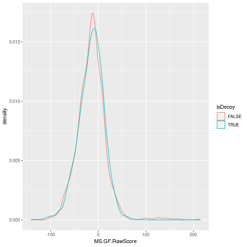

&#x25BA; Question

The *[tidyverse](https://CRAN.R-project.org/package=tidyverse)* tools
are fit for data wrangling with identification data. Using the above
identification dataframe, calculate the length of each peptide (you can
use `nchar` with the peptide sequence `sequence`) and the number of
peptides for each protein (defined as `DatabaseDescription`). Plot the
length of the proteins against their respective number of peptides.

&#x25BA; Solution

    suppressPackageStartupMessages(library("dplyr"))
    iddf <- as_tibble(id_filtered) %>%
        mutate(peplen = nchar(sequence))
    npeps <- iddf %>%
        group_by(DatabaseAccess) %>%
        tally
    iddf <- full_join(iddf, npeps)

    ## Joining, by = "DatabaseAccess"

    library("ggplot2")
    ggplot(iddf, aes(x = n, y = DBseqLength)) + geom_point()

If you would like to learn more about how the mzid data are handled by
`PSMatch` via the *[mzR](https://bioconductor.org/packages/3.15/mzR)*
and *[mzID](https://bioconductor.org/packages/3.15/mzID)* packages,
check out the @ref(sec-id2) section in the annex.

### Adding identification data to raw data

We are goind to use the `sp` object created in the previous chapter and
the `id_filtered` variable generated above.

Identification data (as a `DataFrame`) can be merged into raw data (as a
`Spectra` object) by adding new spectra variables to the appropriate MS2
spectra. Scans and peptide-spectrum matches can be matched by their
spectrum identifers.

&#x25BA; Question

Identify the spectum identifier columns in the `sp` the `id_filtered`
variables.

&#x25BA; Solution

In the raw data, it is encoded as `spectrumId`, while in the
identification data, we have `spectrumID`.

    spectraVariables(sp)

    ##  [1] "msLevel"                  "rtime"                    "acquisitionNum"           "scanIndex"               
    ##  [5] "dataStorage"              "dataOrigin"               "centroided"               "smoothed"                
    ##  [9] "polarity"                 "precScanNum"              "precursorMz"              "precursorIntensity"      
    ## [13] "precursorCharge"          "collisionEnergy"          "isolationWindowLowerMz"   "isolationWindowTargetMz" 
    ## [17] "isolationWindowUpperMz"   "peaksCount"               "totIonCurrent"            "basePeakMZ"              
    ## [21] "basePeakIntensity"        "ionisationEnergy"         "lowMZ"                    "highMZ"                  
    ## [25] "mergedScan"               "mergedResultScanNum"      "mergedResultStartScanNum" "mergedResultEndScanNum"  
    ## [29] "injectionTime"            "filterString"             "spectrumId"               "ionMobilityDriftTime"    
    ## [33] "scanWindowLowerLimit"     "scanWindowUpperLimit"

    names(id_filtered)

    ##  [1] "sequence"                 "spectrumID"               "chargeState"              "rank"                    
    ##  [5] "passThreshold"            "experimentalMassToCharge" "calculatedMassToCharge"   "peptideRef"              
    ##  [9] "modNum"                   "isDecoy"                  "post"                     "pre"                     
    ## [13] "start"                    "end"                      "DatabaseAccess"           "DBseqLength"             
    ## [17] "DatabaseSeq"              "DatabaseDescription"      "scan.number.s."           "acquisitionNum"          
    ## [21] "spectrumFile"             "idFile"                   "MS.GF.RawScore"           "MS.GF.DeNovoScore"       
    ## [25] "MS.GF.SpecEValue"         "MS.GF.EValue"             "MS.GF.QValue"             "MS.GF.PepQValue"         
    ## [29] "modPeptideRef"            "modName"                  "modMass"                  "modLocation"             
    ## [33] "subOriginalResidue"       "subReplacementResidue"    "subLocation"

We still have several PTMs that are matched to a single spectrum
identifier:

    table(table(id_filtered$spectrumID))

    ## 
    ##    1    2    3    4 
    ## 2630   13    2    1

Let’s look at `"controllerType=0 controllerNumber=1 scan=5490"`, the has
4 matching PSMs in detail.

    which(table(id_filtered$spectrumID) == 4)

    ## controllerType=0 controllerNumber=1 scan=5490 
    ##                                          1903

    id_4 <- id_filtered[id_filtered$spectrumID == "controllerType=0 controllerNumber=1 scan=5490", ] %>%
        as.data.frame()
    id_4

    ##           sequence                                    spectrumID chargeState rank passThreshold
    ## 1 KCNQCLKVACTLFYCK controllerType=0 controllerNumber=1 scan=5490           3    1          TRUE
    ## 2 KCNQCLKVACTLFYCK controllerType=0 controllerNumber=1 scan=5490           3    1          TRUE
    ## 3 KCNQCLKVACTLFYCK controllerType=0 controllerNumber=1 scan=5490           3    1          TRUE
    ## 4 KCNQCLKVACTLFYCK controllerType=0 controllerNumber=1 scan=5490           3    1          TRUE
    ##   experimentalMassToCharge calculatedMassToCharge peptideRef modNum isDecoy post pre start end DatabaseAccess
    ## 1                 698.6633               698.3315     Pep453      4   FALSE    C   K   127 142        ECA0668
    ## 2                 698.6633               698.3315     Pep453      4   FALSE    C   K   127 142        ECA0668
    ## 3                 698.6633               698.3315     Pep453      4   FALSE    C   K   127 142        ECA0668
    ## 4                 698.6633               698.3315     Pep453      4   FALSE    C   K   127 142        ECA0668
    ##   DBseqLength DatabaseSeq          DatabaseDescription scan.number.s. acquisitionNum
    ## 1         302             ECA0668 hypothetical protein           5490           5490
    ## 2         302             ECA0668 hypothetical protein           5490           5490
    ## 3         302             ECA0668 hypothetical protein           5490           5490
    ## 4         302             ECA0668 hypothetical protein           5490           5490
    ##                                                          spectrumFile
    ## 1 TMT_Erwinia_1uLSike_Top10HCD_isol2_45stepped_60min_01-20141210.mzML
    ## 2 TMT_Erwinia_1uLSike_Top10HCD_isol2_45stepped_60min_01-20141210.mzML
    ## 3 TMT_Erwinia_1uLSike_Top10HCD_isol2_45stepped_60min_01-20141210.mzML
    ## 4 TMT_Erwinia_1uLSike_Top10HCD_isol2_45stepped_60min_01-20141210.mzML
    ##                                                                idFile MS.GF.RawScore MS.GF.DeNovoScore
    ## 1 TMT_Erwinia_1uLSike_Top10HCD_isol2_45stepped_60min_01-20141210.mzid            -22                79
    ## 2 TMT_Erwinia_1uLSike_Top10HCD_isol2_45stepped_60min_01-20141210.mzid            -22                79
    ## 3 TMT_Erwinia_1uLSike_Top10HCD_isol2_45stepped_60min_01-20141210.mzid            -22                79
    ## 4 TMT_Erwinia_1uLSike_Top10HCD_isol2_45stepped_60min_01-20141210.mzid            -22                79
    ##   MS.GF.SpecEValue MS.GF.EValue MS.GF.QValue MS.GF.PepQValue modPeptideRef         modName  modMass modLocation
    ## 1     4.555588e-07     1.307689    0.9006211       0.8901099        Pep453 Carbamidomethyl 57.02146           2
    ## 2     4.555588e-07     1.307689    0.9006211       0.8901099        Pep453 Carbamidomethyl 57.02146           5
    ## 3     4.555588e-07     1.307689    0.9006211       0.8901099        Pep453 Carbamidomethyl 57.02146          10
    ## 4     4.555588e-07     1.307689    0.9006211       0.8901099        Pep453 Carbamidomethyl 57.02146          15
    ##   subOriginalResidue subReplacementResidue subLocation
    ## 1               <NA>                  <NA>          NA
    ## 2               <NA>                  <NA>          NA
    ## 3               <NA>                  <NA>          NA
    ## 4               <NA>                  <NA>          NA

We can see that these 4 PSMs differ by the location of the
Carbamidomethyl modification.

    id_4[, c("modName", "modLocation")]

    ##           modName modLocation
    ## 1 Carbamidomethyl           2
    ## 2 Carbamidomethyl           5
    ## 3 Carbamidomethyl          10
    ## 4 Carbamidomethyl          15

Let’s reduce that PSM table before joining it to the `Spectra` object,
to make sure we have unique one-to-one matches between the raw spectra
and the PSMs.

    id_filtered <- reducePSMs(id_filtered, id_filtered$spectrumID)
    id_filtered

    ## Reduced PSM with 2646 rows and 35 columns.
    ## names(35): sequence spectrumID ... subReplacementResidue subLocation

These two data can thus simply be joined using:

    sp <- joinSpectraData(sp, id_filtered,
                          by.x = "spectrumId",
                          by.y = "spectrumID")
    spectraVariables(sp)

    ##  [1] "msLevel"                  "rtime"                    "acquisitionNum"           "scanIndex"               
    ##  [5] "dataStorage"              "dataOrigin"               "centroided"               "smoothed"                
    ##  [9] "polarity"                 "precScanNum"              "precursorMz"              "precursorIntensity"      
    ## [13] "precursorCharge"          "collisionEnergy"          "isolationWindowLowerMz"   "isolationWindowTargetMz" 
    ## [17] "isolationWindowUpperMz"   "peaksCount"               "totIonCurrent"            "basePeakMZ"              
    ## [21] "basePeakIntensity"        "ionisationEnergy"         "lowMZ"                    "highMZ"                  
    ## [25] "mergedScan"               "mergedResultScanNum"      "mergedResultStartScanNum" "mergedResultEndScanNum"  
    ## [29] "injectionTime"            "filterString"             "spectrumId"               "ionMobilityDriftTime"    
    ## [33] "scanWindowLowerLimit"     "scanWindowUpperLimit"     "sequence"                 "chargeState"             
    ## [37] "rank"                     "passThreshold"            "experimentalMassToCharge" "calculatedMassToCharge"  
    ## [41] "peptideRef"               "modNum"                   "isDecoy"                  "post"                    
    ## [45] "pre"                      "start"                    "end"                      "DatabaseAccess"          
    ## [49] "DBseqLength"              "DatabaseSeq"              "DatabaseDescription"      "scan.number.s."          
    ## [53] "acquisitionNum.y"         "spectrumFile"             "idFile"                   "MS.GF.RawScore"          
    ## [57] "MS.GF.DeNovoScore"        "MS.GF.SpecEValue"         "MS.GF.EValue"             "MS.GF.QValue"            
    ## [61] "MS.GF.PepQValue"          "modPeptideRef"            "modName"                  "modMass"                 
    ## [65] "modLocation"              "subOriginalResidue"       "subReplacementResidue"    "subLocation"

&#x25BA; Question

Verify that the identification data has been added to the correct
spectra.

&#x25BA; Solution

Let’s first verify that no identification data has been added to the MS1
scans.

    all(is.na(filterMsLevel(sp, 1)$sequence))

    ## [1] TRUE

They have indeed been added to 56% of the MS2 spectra.

    sp_2 <- filterMsLevel(sp, 2)
    table(is.na(sp_2$sequence))

    ## 
    ## FALSE  TRUE 
    ##  2646  3457

Let’s compare the precursor/peptide mass to charges

    sp_2 <- sp_2[!is.na(sp_2$sequence)]
    summary(sp_2$precursorMz - sp_2$experimentalMassToCharge)

    ##    Min. 1st Qu.  Median    Mean 3rd Qu.    Max. 
    ##  0.0000  0.0000  0.0000  0.0053  0.0000  2.0297

### An identification-annotated chromatogram

Now that we have combined raw data and their associated peptide-spectrum
matches, we can produce an improved total ion chromatogram, identifying
MS1 scans that lead to successful identifications.

The `countIdentifications()` function is going to tally the number of
identifications (i.e non-missing characters in the `sequence` spectra
variable) for each scan. In the case of MS2 scans, these will be either
1 or 0, depending on the presence of a sequence. For MS1 scans, the
function will count the number of sequences for the descendant MS2
scans, i.e. those produced from precursor ions from each MS1 scan.

    sp <- countIdentifications(sp)

Below, we see on the second line that 3457 MS2 scans lead to no PSM,
while 2546 lead to an identification. Among all MS1 scans, 833 lead to
no MS2 scans with PSMs. 30 MS1 scans generated one MS2 scan that lead to
a PSM, 45 lead to two PSMs, …

    table(msLevel(sp), sp$countIdentifications)

    ##    
    ##        0    1    2    3    4    5    6    7    8    9   10
    ##   1  833   30   45   97  139  132   92   42   17    3    1
    ##   2 3457 2646    0    0    0    0    0    0    0    0    0

These data can also be visualised on the total ion chromatogram:

    sp |>
    filterMsLevel(1) |>
    spectraData() |>
    as_tibble() |>
    ggplot(aes(x = rtime,
               y = totIonCurrent)) +
        geom_line(alpha = 0.25) +
        geom_point(aes(colour = ifelse(countIdentifications == 0,
                                       NA, countIdentifications)),
                   size = 0.75,
                   alpha = 0.5) +
        labs(colour = "Number of ids")

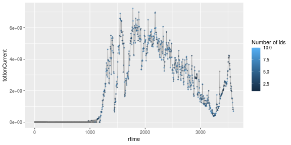

### Visualising peptide-spectrum matches

Let’s choose a MS2 spectrum with a high identification score and plot
it.

    i <- which(sp$MS.GF.RawScore > 100)[1]
    plotSpectra(sp[i])

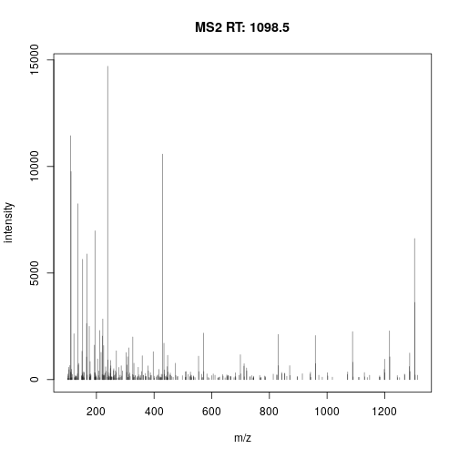

We have seen above that we can add labels to each peak using the
`labels` argument in `plotSpectra()`. The `addFragments()` function
takes a spectrum as input (that is a `Spectra` object of length 1) and
annotates its peaks.

    addFragments(sp[i])

    ##   [1] NA     NA     NA     "b1"   NA     NA     NA     NA     NA     NA     NA     NA     NA     NA     NA    
    ##  [16] NA     NA     NA     NA     NA     NA     NA     NA     NA     NA     NA     NA     NA     NA     NA    
    ##  [31] NA     NA     NA     NA     NA     NA     NA     NA     NA     NA     NA     NA     NA     "y1_"  NA    
    ##  [46] NA     NA     NA     NA     "y1"   NA     NA     NA     NA     NA     NA     NA     NA     NA     NA    
    ##  [61] NA     NA     NA     NA     NA     NA     NA     NA     NA     NA     NA     NA     NA     NA     NA    
    ##  [76] NA     NA     NA     NA     NA     NA     NA     NA     NA     NA     NA     "b2"   NA     NA     NA    
    ##  [91] NA     NA     NA     NA     NA     NA     NA     NA     NA     NA     NA     NA     NA     NA     NA    
    ## [106] NA     NA     NA     NA     NA     NA     NA     NA     NA     NA     NA     NA     "y2_"  "y2*"  NA    
    ## [121] NA     "y2"   NA     NA     NA     NA     NA     NA     NA     NA     NA     NA     "b3"   NA     NA    
    ## [136] NA     NA     NA     NA     NA     NA     NA     NA     NA     NA     NA     NA     NA     NA     NA    
    ## [151] NA     NA     NA     NA     NA     NA     NA     NA     NA     NA     NA     NA     NA     NA     NA    
    ## [166] NA     NA     NA     NA     NA     "y3*"  NA     NA     NA     NA     NA     NA     NA     NA     NA    
    ## [181] "y3"   NA     "b4_"  NA     NA     NA     NA     NA     NA     NA     NA     NA     "b4"   NA     NA    
    ## [196] NA     NA     NA     NA     NA     NA     NA     NA     NA     NA     NA     NA     NA     NA     NA    
    ## [211] NA     NA     NA     NA     NA     NA     NA     "y4*"  NA     "b5_"  "b5*"  NA     "y4"   NA     "b5"  
    ## [226] NA     NA     NA     NA     NA     NA     NA     NA     NA     NA     NA     NA     NA     NA     NA    
    ## [241] NA     NA     NA     NA     NA     NA     "y5_"  "y5*"  NA     "b6_"  "y5"   NA     NA     "b6"   NA    
    ## [256] NA     NA     NA     NA     NA     NA     NA     NA     NA     NA     NA     NA     NA     NA     NA    
    ## [271] NA     "y6*"  "b7_"  NA     "y6"   NA     NA     "b7"   NA     NA     NA     NA     NA     NA     NA    
    ## [286] NA     "y7_"  "y7*"  NA     "y7"   NA     "b8"   NA     NA     NA     NA     "y8_"  "y8*"  "y8"   NA    
    ## [301] NA     NA     NA     NA     NA     NA     NA     NA     NA     NA     "y9_"  "y9*"  NA     "y9"   NA    
    ## [316] NA     NA     NA     NA     NA     "y10_" "y10*" NA     "y10"  NA     NA     NA

It can be directly used with `plotSpectra()`:

    plotSpectra(sp[i], labels = addFragments,
                labelPos = 3, labelCol = "steelblue")

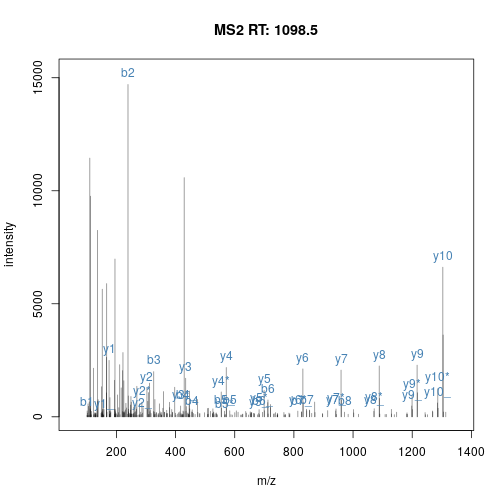

When a precursor peptide ion is fragmented in a CID cell, it breaks at
specific bonds, producing sets of peaks (*a*, *b*, *c* and *x*, *y*,
*z*) that can be predicted.

Peptide fragmentation.

The annotation of spectra is obtained by simulating fragmentation of a
peptide and matching observed peaks to fragments:

    sp[i]$sequence

    ## [1] "THSQEEMQHMQR"

    calculateFragments(sp[i]$sequence)

    ## Modifications used: C=57.02146

    ##           mz  ion type pos z         seq
    ## 1   102.0550   b1    b   1 1           T
    ## 2   239.1139   b2    b   2 1          TH
    ## 3   326.1459   b3    b   3 1         THS
    ## 4   454.2045   b4    b   4 1        THSQ
    ## 5   583.2471   b5    b   5 1       THSQE
    ## 6   712.2897   b6    b   6 1      THSQEE
    ## 7   843.3301   b7    b   7 1     THSQEEM
    ## 8   971.3887   b8    b   8 1    THSQEEMQ
    ## 9  1108.4476   b9    b   9 1   THSQEEMQH
    ## 10 1239.4881  b10    b  10 1  THSQEEMQHM
    ## 11 1367.5467  b11    b  11 1 THSQEEMQHMQ
    ## 12  175.1190   y1    y   1 1           R
    ## 13  303.1775   y2    y   2 1          QR
    ## 14  434.2180   y3    y   3 1         MQR
    ## 15  571.2769   y4    y   4 1        HMQR
    ## 16  699.3355   y5    y   5 1       QHMQR
    ## 17  830.3760   y6    y   6 1      MQHMQR
    ## 18  959.4186   y7    y   7 1     EMQHMQR
    ## 19 1088.4612   y8    y   8 1    EEMQHMQR
    ## 20 1216.5198   y9    y   9 1   QEEMQHMQR
    ## 21 1303.5518  y10    y  10 1  SQEEMQHMQR
    ## 22 1440.6107  y11    y  11 1 HSQEEMQHMQR
    ## 23  436.1939  b4_   b_   4 1        THSQ
    ## 24  565.2365  b5_   b_   5 1       THSQE
    ## 25  694.2791  b6_   b_   6 1      THSQEE
    ## 26  825.3196  b7_   b_   7 1     THSQEEM
    ## 27  953.3782  b8_   b_   8 1    THSQEEMQ
    ## 28 1090.4371  b9_   b_   9 1   THSQEEMQH
    ## 29 1221.4776 b10_   b_  10 1  THSQEEMQHM
    ## 30 1349.5361 b11_   b_  11 1 THSQEEMQHMQ
    ## 31  941.4080  y7_   y_   7 1     EMQHMQR
    ## 32 1070.4506  y8_   y_   8 1    EEMQHMQR
    ## 33 1422.6001 y11_   y_  11 1 HSQEEMQHMQR
    ## 34  157.1084  y1_   y_   1 1           R
    ## 35  285.1670  y2_   y_   2 1          QR
    ## 36  416.2075  y3_   y_   3 1         MQR
    ## 37  553.2664  y4_   y_   4 1        HMQR
    ## 38  681.3249  y5_   y_   5 1       QHMQR
    ## 39  812.3654  y6_   y_   6 1      MQHMQR
    ## 40 1198.5092  y9_   y_   9 1   QEEMQHMQR
    ## 41 1285.5412 y10_   y_  10 1  SQEEMQHMQR
    ## 42  566.2205  b5*   b*   5 1       THSQE
    ## 43  695.2631  b6*   b*   6 1      THSQEE
    ## 44  826.3036  b7*   b*   7 1     THSQEEM
    ## 45  954.3622  b8*   b*   8 1    THSQEEMQ
    ## 46 1091.4211  b9*   b*   9 1   THSQEEMQH
    ## 47 1222.4616 b10*   b*  10 1  THSQEEMQHM
    ## 48 1350.5202 b11*   b*  11 1 THSQEEMQHMQ
    ## 49  286.1510  y2*   y*   2 1          QR
    ## 50  417.1915  y3*   y*   3 1         MQR
    ## 51  554.2504  y4*   y*   4 1        HMQR
    ## 52  682.3090  y5*   y*   5 1       QHMQR
    ## 53  813.3495  y6*   y*   6 1      MQHMQR
    ## 54  942.3920  y7*   y*   7 1     EMQHMQR
    ## 55 1071.4346  y8*   y*   8 1    EEMQHMQR
    ## 56 1199.4932  y9*   y*   9 1   QEEMQHMQR
    ## 57 1286.5252 y10*   y*  10 1  SQEEMQHMQR
    ## 58 1423.5842 y11*   y*  11 1 HSQEEMQHMQR

### Comparing spectra

The `compareSpectra()` function can be used to compare spectra (by
default, computing the normalised dot product).

&#x25BA; Question

1.  Create a new `Spectra` object containing the MS2 spectra with
    sequences `"SQILQQAGTSVLSQANQVPQTVLSLLR"` and
    `"TKGLNVMQNLLTAHPDVQAVFAQNDEMALGALR"`.

&#x25BA; Solution

    k <- which(sp$sequence %in% c("SQILQQAGTSVLSQANQVPQTVLSLLR", "TKGLNVMQNLLTAHPDVQAVFAQNDEMALGALR"))
    sp_k <- sp[k]
    sp_k

    ## MSn data (Spectra) with 5 spectra in a MsBackendMzR backend:
    ##     msLevel     rtime scanIndex
    ##   <integer> <numeric> <integer>
    ## 1         2   2687.42      5230
    ## 2         2   2688.88      5235
    ## 3         2   2748.75      5397
    ## 4         2   2765.26      5442
    ## 5         2   2768.17      5449
    ##  ... 68 more variables/columns.
    ## 
    ## file(s):
    ## 1922b2f30fe_TMT_Erwinia_1uLSike_Top10HCD_isol2_45stepped_60min_01-20141210.mzML

&#x25BA; Question

1.  Calculate the 5 by 5 distance matrix between all spectra using
    `compareSpectra`. See the `?Spectra` man page for details. Draw a
    heatmap of that distance matrix

&#x25BA; Solution

    distmat <- compareSpectra(sp_k)
    rownames(distmat) <- colnames(distmat) <- strtrim(sp_k$sequence, 2)
    distmat

    ##              TK          TK           SQ          SQ           SQ
    ## TK 1.0000000000 0.109126094 0.0009373465 0.001261338 0.0008256185
    ## TK 0.1091260942 1.000000000 0.0025314670 0.001459654 0.0017613212
    ## SQ 0.0009373465 0.002531467 1.0000000000 0.432133016 0.6879331218
    ## SQ 0.0012613380 0.001459654 0.4321330158 1.000000000 0.4467153012
    ## SQ 0.0008256185 0.001761321 0.6879331218 0.446715301 1.0000000000

    pheatmap::pheatmap(distmat)

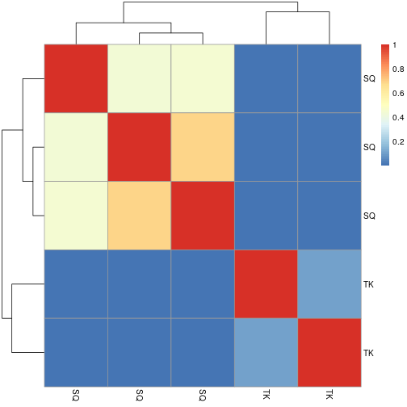

&#x25BA; Question

1.  Compare the spectra with the plotting function seen previously.

&#x25BA; Solution

    filterIntensity(sp_k, 1e3) %>% plotSpectra(main = sp_k$sequence)

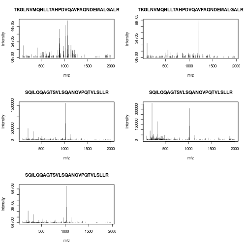

    par(mfrow = c(3, 1))
    plotSpectraMirror(sp_k[1], sp_k[2], main = "TK...")
    plotSpectraMirror(sp_k[3], sp_k[4], main = "SQ...")
    plotSpectraMirror(sp_k[3], sp_k[4], main = "SQ...")

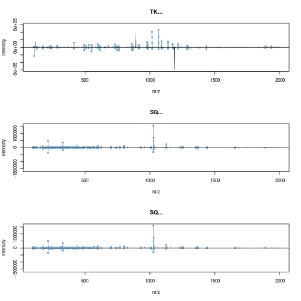

### Summary exercise

&#x25BA; Question

Download the 3 first mzML and mzID files from the
[PXD022816](https://www.ebi.ac.uk/pride/archive/projects/PXD022816)
project \[@Morgenstern:2020\].

&#x25BA; Solution

    ## Getting data from PX/PRIDE
    library(rpx)

    ## https://www.ebi.ac.uk/pride/archive/projects/PXD022816
    ## RawBeans: A Simple, Vendor-Independent, Raw-Data Quality-Control
    ## Tool ()

    PXD022816 <- PXDataset("PXD022816")

    ## Loading PXD022816 from cache.

    PXD022816

    ## Project PXD022816 with 31 files
    ## 

    ## Resource ID BFC3 in cache in /home/rstudio/.cache/R/rpx.

    ##  [1] 'checksum.txt' ... [31] 'QEP2LC6_HeLa_50ng_251120_10-calib.mzML'
    ##  Use 'pxfiles(.)' to see all files.

    pxfiles(PXD022816)

    ## Project PXD022816 files (31):
    ##  [remote] checksum.txt
    ##  [remote] QEP2LC6_HeLa_50ng_251120_01.raw
    ##  [remote] QEP2LC6_HeLa_50ng_251120_02.raw
    ##  [remote] QEP2LC6_HeLa_50ng_251120_03.raw
    ##  [remote] QEP2LC6_HeLa_50ng_251120_04.raw
    ##  [remote] QEP2LC6_HeLa_50ng_251120_05.raw
    ##  [remote] QEP2LC6_HeLa_50ng_251120_06.raw
    ##  [remote] QEP2LC6_HeLa_50ng_251120_07.raw
    ##  [remote] QEP2LC6_HeLa_50ng_251120_08.raw
    ##  [remote] QEP2LC6_HeLa_50ng_251120_09.raw
    ##  ...

    (mzids <- pxget(PXD022816, grep("mzID", pxfiles(PXD022816))[1:3]))

    ## Project PXD022816 files (31):
    ##  [remote] checksum.txt
    ##  [remote] QEP2LC6_HeLa_50ng_251120_01.raw
    ##  [remote] QEP2LC6_HeLa_50ng_251120_02.raw
    ##  [remote] QEP2LC6_HeLa_50ng_251120_03.raw
    ##  [remote] QEP2LC6_HeLa_50ng_251120_04.raw
    ##  [remote] QEP2LC6_HeLa_50ng_251120_05.raw
    ##  [remote] QEP2LC6_HeLa_50ng_251120_06.raw
    ##  [remote] QEP2LC6_HeLa_50ng_251120_07.raw
    ##  [remote] QEP2LC6_HeLa_50ng_251120_08.raw
    ##  [remote] QEP2LC6_HeLa_50ng_251120_09.raw
    ##  ...

    ## Loading QEP2LC6_HeLa_50ng_251120_01-calib.mzID.gz from cache.

    ## Loading QEP2LC6_HeLa_50ng_251120_02-calib.mzID.gz from cache.

    ## Loading QEP2LC6_HeLa_50ng_251120_03-calib.mzID.gz from cache.

    ## [1] "/home/rstudio/.cache/R/rpx/192cfb2598_QEP2LC6_HeLa_50ng_251120_01-calib.mzID.gz" 
    ## [2] "/home/rstudio/.cache/R/rpx/1922fadfa6a_QEP2LC6_HeLa_50ng_251120_02-calib.mzID.gz"
    ## [3] "/home/rstudio/.cache/R/rpx/1923339dcf8_QEP2LC6_HeLa_50ng_251120_03-calib.mzID.gz"

    (mzmls <- pxget(PXD022816, grep("mzML", pxfiles(PXD022816))[1:3]))

    ## Project PXD022816 files (31):
    ##  [remote] checksum.txt
    ##  [remote] QEP2LC6_HeLa_50ng_251120_01.raw
    ##  [remote] QEP2LC6_HeLa_50ng_251120_02.raw
    ##  [remote] QEP2LC6_HeLa_50ng_251120_03.raw
    ##  [remote] QEP2LC6_HeLa_50ng_251120_04.raw
    ##  [remote] QEP2LC6_HeLa_50ng_251120_05.raw
    ##  [remote] QEP2LC6_HeLa_50ng_251120_06.raw
    ##  [remote] QEP2LC6_HeLa_50ng_251120_07.raw
    ##  [remote] QEP2LC6_HeLa_50ng_251120_08.raw
    ##  [remote] QEP2LC6_HeLa_50ng_251120_09.raw
    ##  ...

    ## Loading QEP2LC6_HeLa_50ng_251120_01-calib.mzML from cache.

    ## Loading QEP2LC6_HeLa_50ng_251120_02-calib.mzML from cache.

    ## Loading QEP2LC6_HeLa_50ng_251120_03-calib.mzML from cache.

    ## [1] "/home/rstudio/.cache/R/rpx/1927c32146b_QEP2LC6_HeLa_50ng_251120_01-calib.mzML"
    ## [2] "/home/rstudio/.cache/R/rpx/19220a6c926_QEP2LC6_HeLa_50ng_251120_02-calib.mzML"
    ## [3] "/home/rstudio/.cache/R/rpx/1925cd794ab_QEP2LC6_HeLa_50ng_251120_03-calib.mzML"

&#x25BA; Question

Generate a `Spectra` object and a table of filtered PSMs. Visualise the
total ion chromatograms and check the quality of the identification data
by comparing the density of the decoy and target PSMs id scores for each
file.

&#x25BA; Solution

    ## Loading raw data
    library("Spectra")
    sp <- Spectra(mzmls)
    sp

    ## MSn data (Spectra) with 87647 spectra in a MsBackendMzR backend:
    ##         msLevel     rtime scanIndex
    ##       <integer> <numeric> <integer>
    ## 1             1  0.177987         1
    ## 2             1  0.599870         2
    ## 3             1  0.978849         3
    ## 4             1  1.363217         4
    ## 5             1  1.742965         5
    ## ...         ...       ...       ...
    ## 87643         1   4198.64     28736
    ## 87644         1   4199.02     28737
    ## 87645         2   4199.28     28738
    ## 87646         1   4199.44     28739
    ## 87647         1   4199.82     28740
    ##  ... 33 more variables/columns.
    ## 
    ## file(s):
    ## 1927c32146b_QEP2LC6_HeLa_50ng_251120_01-calib.mzML
    ## 19220a6c926_QEP2LC6_HeLa_50ng_251120_02-calib.mzML
    ## 1925cd794ab_QEP2LC6_HeLa_50ng_251120_03-calib.mzML

    ## number of spectra per file
    table(basename(sp$dataOrigin))

    ## 
    ## 19220a6c926_QEP2LC6_HeLa_50ng_251120_02-calib.mzML 1925cd794ab_QEP2LC6_HeLa_50ng_251120_03-calib.mzML 
    ##                                              29332                                              28740 
    ## 1927c32146b_QEP2LC6_HeLa_50ng_251120_01-calib.mzML 
    ##                                              29575

    ## all levels are centroided
    table(sp$centroided, sp$msLevel)

    ##       
    ##            1     2
    ##   TRUE 19607 68040

    library("ggplot2")
    library("tidyr")
    library("magrittr")

    ## Chromatograms
    filterMsLevel(sp, 1) %>%
        spectraData() %>%
        as_tibble() %>%
        ggplot(aes(x = rtime,
                   y = totIonCurrent,
                   colour = basename(dataOrigin))) +
        geom_line()

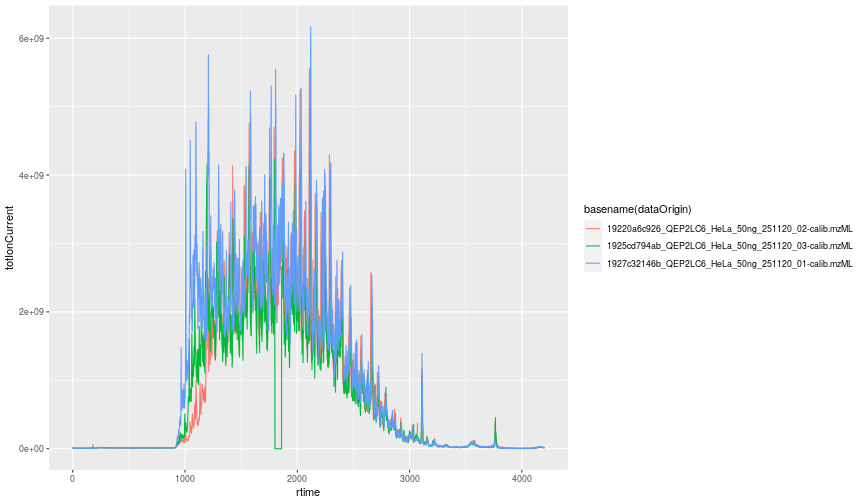

    ## Identification data
    library("PSMatch")
    id <- PSM(mzids)

    ## Number of PSMs per acquisition
    table(id$idFile)

    ## 
    ## 1922fadfa6a_QEP2LC6_HeLa_50ng_251120_02-calib.mzID.gz 1923339dcf8_QEP2LC6_HeLa_50ng_251120_03-calib.mzID.gz 
    ##                                                 25083                                                 24436 
    ##  192cfb2598_QEP2LC6_HeLa_50ng_251120_01-calib.mzID.gz 
    ##                                                 25231

    tidyr::as_tibble(id) %>%
        ggplot(aes(x = MetaMorpheus.score,
                   colour = isDecoy)) +
        geom_density() +
        facet_wrap(~ spectrumFile)

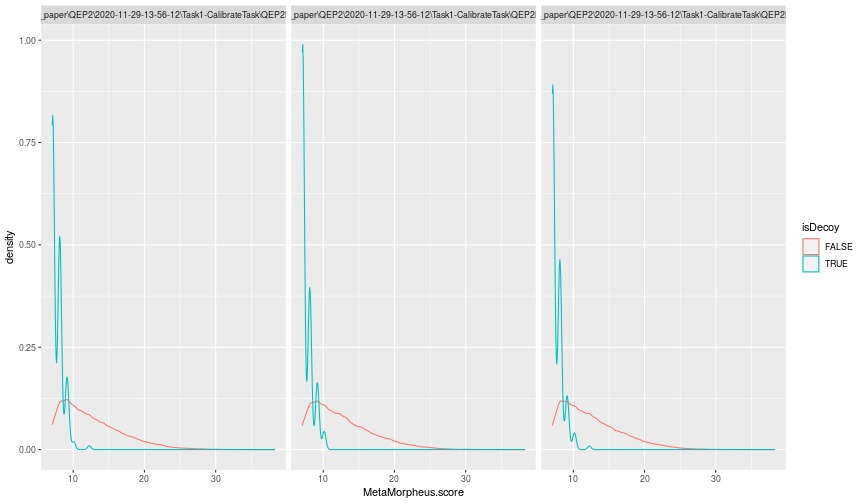

    id_filtered <- filterPSMs(id)

    ## Starting with 74750 PSMs:

    ## Removed 543 decoy hits.

    ## Removed 0 PSMs with rank > 1.

    ## Removed 11310 shared peptides.

    ## 62897 PSMs left.

    max(id_filtered$PSM.level.q.value)

    ## [1] 0.009994817

&#x25BA; Question

Join the raw and identification data. Beware though that the joining
must now be performed by spectrum ids and by files.

&#x25BA; Solution

    ## primary key for spectra
    sp$pkey <-
        paste0(sub("^.+_QEP", "QEP", basename(dataOrigin(sp))),
               gsub("^.+=", "::", sp$spectrumId))
    head(sp$pkey)

    ## [1] "QEP2LC6_HeLa_50ng_251120_01-calib.mzML::1" "QEP2LC6_HeLa_50ng_251120_01-calib.mzML::2"
    ## [3] "QEP2LC6_HeLa_50ng_251120_01-calib.mzML::3" "QEP2LC6_HeLa_50ng_251120_01-calib.mzML::4"
    ## [5] "QEP2LC6_HeLa_50ng_251120_01-calib.mzML::5" "QEP2LC6_HeLa_50ng_251120_01-calib.mzML::6"

    ## primary key for PSMs
    id_filtered$pkey <-
        paste0(gsub("^.+\\QEP", "QEP", id_filtered$spectrumFile),
               sub("^.+=", "::", id_filtered$spectrumID))
    head(id_filtered$pkey)

    ## [1] "QEP2LC6_HeLa_50ng_251120_01-calib.mzML::3426"  "QEP2LC6_HeLa_50ng_251120_01-calib.mzML::20165"
    ## [3] "QEP2LC6_HeLa_50ng_251120_01-calib.mzML::20180" "QEP2LC6_HeLa_50ng_251120_01-calib.mzML::15180"
    ## [5] "QEP2LC6_HeLa_50ng_251120_01-calib.mzML::10327" "QEP2LC6_HeLa_50ng_251120_01-calib.mzML::12894"

    ## For simplicity, let keep single hits per spectrum id.
    ## Alternatively, explore duplicates and use QFeatures::reduceDataFrame
    id_filtered <- id_filtered[!duplicated(id_filtered$pkey), ]

    head(id_filtered$pkey)

    ## [1] "QEP2LC6_HeLa_50ng_251120_01-calib.mzML::3426"  "QEP2LC6_HeLa_50ng_251120_01-calib.mzML::20165"
    ## [3] "QEP2LC6_HeLa_50ng_251120_01-calib.mzML::20180" "QEP2LC6_HeLa_50ng_251120_01-calib.mzML::15180"
    ## [5] "QEP2LC6_HeLa_50ng_251120_01-calib.mzML::10327" "QEP2LC6_HeLa_50ng_251120_01-calib.mzML::12894"

    sp <- joinSpectraData(sp, id_filtered, by.x = "pkey")

    ## Number of MS2 scans with a PSM
    table(!is.na(filterMsLevel(sp, 2)$sequence))

    ## 
    ## FALSE  TRUE 
    ## 22006 46034

&#x25BA; Question

Extract the PSMs that have been matched to peptides from protein
`O43175` and compare and cluster the scans. Hint: once you have created
the smaller `Spectra` object with the scans of interest, switch to an
in-memory backend to seed up the calculations.

&#x25BA; Solution

    sp_O43175 <- sp[which(sp$DatabaseAccess == "O43175")]
    sp_O43175 <- setBackend(sp_O43175, MsBackendDataFrame())
    sp_O43175

    ## MSn data (Spectra) with 77 spectra in a MsBackendDataFrame backend:
    ##       msLevel     rtime scanIndex
    ##     <integer> <numeric> <integer>
    ## 1           2   1496.36      8143
    ## 2           2   1518.19      8362
    ## 3           2   1582.59      9009
    ## 4           2   1587.08      9056
    ## 5           2   1708.69     10288
    ## ...       ...       ...       ...
    ## 73          2   3148.28     23503
    ## 74          2   3242.61     24333
    ## 75          2   3436.78     25513
    ## 76          2   3547.90     26170
    ## 77          2   3563.78     26314
    ##  ... 65 more variables/columns.
    ## Processing:
    ##  Switch backend from MsBackendMzR to MsBackendDataFrame [Fri Jun 24 22:36:27 2022]

    cmat <- compareSpectra(sp_O43175)
    rownames(cmat) <-
        colnames(cmat) <- strtrim(sp_O43175$sequence, 3)

    pheatmap::pheatmap(cmat)

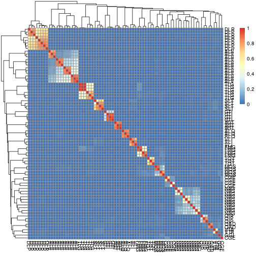

    (i <- which(rownames(cmat) == "DLP"))

    ## [1] 21 23 45 46 49 73 74 77

    plotSpectra(sp_O43175[i], labels = addFragments,
                labelPos = 3, labelCol = "steelblue",
                main = sp_O43175$sequence[i])

    spectraData(sp_O43175[i])$precursorCharge

    ## [1] 2 2 2 2 2 2 2 2

    spectraData(sp_O43175[i])$precursorMz

    ## [1] 493.8055 515.3086 493.8383 493.8380 515.3084 493.8057 493.8390 515.3087

    spectraData(sp_O43175[i])$modName

    ## [1] NA         "Carbamyl" NA         NA         "Carbamyl" NA         NA         "Carbamyl"

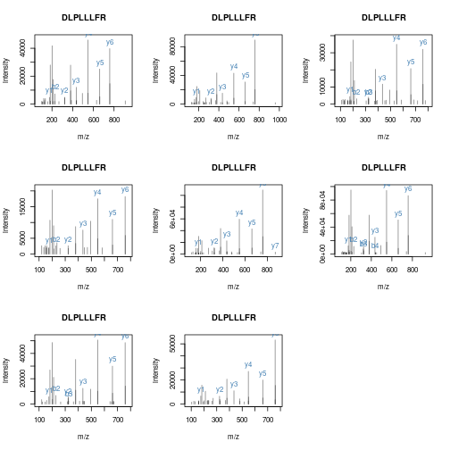

    ## Directly compare spectra with/without Carbamyl
    plotSpectraMirror(sp_O43175[4], sp_O43175[9])

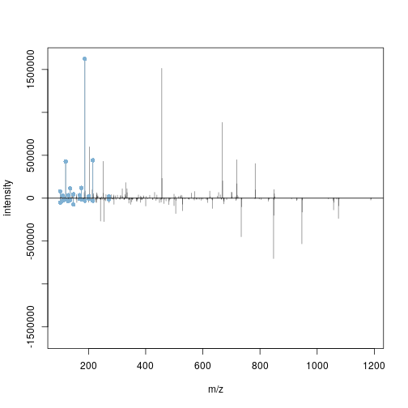

    plotSpectraMirror(sp_O43175[2], sp_O43175[10])

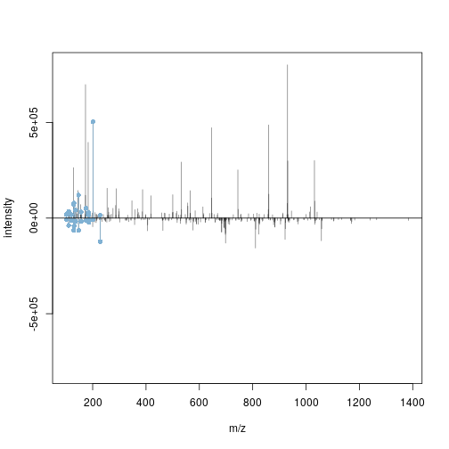

&#x25BA; Question

Generate total ion chromatograms for each acquisition and annotate the
MS1 scans with the number of PSMs using the `countIdentifications()`
function, as shown above. The function will automatically perform the
counts in parallel for each acquisition.

&#x25BA; Solution

    sp <- countIdentifications(sp)
    table(msLevel(sp), sp$countIdentifications)

    ##    
    ##         0     1     2     3     4     5     6     7     8     9    10
    ##   1 12937   488   254   213   237   345   588   991  1439  1401   714
    ##   2 22006 46034     0     0     0     0     0     0     0     0     0

    sp |>
     filterMsLevel(1) |>
     spectraData() |>
     as_tibble() |>
     ggplot(aes(x = rtime,
                y = totIonCurrent)) +
         geom_line(alpha = 0.25) +
         geom_point(aes(colour = ifelse(countIdentifications == 0,
                                        NA, countIdentifications)),
                    size = 0.75,
                    alpha = 0.5) +
         scale_colour_gradient(low = "orange", high = "red") +
         facet_grid(sub("^.+_", "", basename(dataOrigin)) ~ .) +
         labs(colour = "Number of ids")

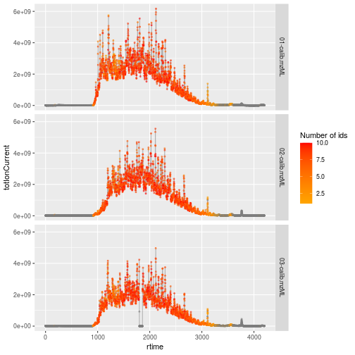

### Exploration and Assessment of Identifications using `MSnID`

The `MSnID` package extracts MS/MS ID data from mzIdentML (leveraging
the `mzID` package) or text files. After collating the search results
from multiple datasets it assesses their identification quality and
optimises filtering criteria to achieve the maximum number of
identifications while not exceeding a specified false discovery rate. It
also contains a number of utilities to explore the MS/MS results and
assess missed and irregular enzymatic cleavages, mass measurement
accuracy, etc.

#### Step-by-step work-flow

Let’s reproduce parts of the analysis described the `MSnID` vignette.
You can explore more with

    vignette("msnid_vignette", package = "MSnID")

The *[MSnID](https://bioconductor.org/packages/3.15/MSnID)* package can
be used for post-search filtering of MS/MS identifications. One starts
with the construction of an `MSnID` object that is populated with
identification results that can be imported from a `data.frame` or from
`mzIdenML` files. Here, we will use the example identification data
provided with the package.

    mzids <- system.file("extdata", "c_elegans.mzid.gz", package="MSnID")
    basename(mzids)

    ## [1] "c_elegans.mzid.gz"

We start by loading the package, initialising the `MSnID` object, and
add the identification result from our `mzid` file (there could of
course be more than one).

    library("MSnID")

    ## 
    ## Attaching package: 'MSnID'

    ## The following object is masked from 'package:ProtGenerics':
    ## 
    ##     peptides

    msnid <- MSnID(".")

    ## Note, the anticipated/suggested columns in the
    ## peptide-to-spectrum matching results are:
    ## -----------------------------------------------
    ## accession
    ## calculatedMassToCharge
    ## chargeState
    ## experimentalMassToCharge
    ## isDecoy
    ## peptide
    ## spectrumFile
    ## spectrumID

    msnid <- read_mzIDs(msnid, mzids)

    ## Reading from mzIdentMLs ...

    ## reading c_elegans.mzid.gz... DONE!

    show(msnid)

    ## MSnID object
    ## Working directory: "."
    ## #Spectrum Files:  1 
    ## #PSMs: 12263 at 36 % FDR
    ## #peptides: 9489 at 44 % FDR
    ## #accessions: 7414 at 76 % FDR

Printing the `MSnID` object returns some basic information such as

-   Working directory.
-   Number of spectrum files used to generate data.
-   Number of peptide-to-spectrum matches and corresponding FDR.
-   Number of unique peptide sequences and corresponding FDR.
-   Number of unique proteins or amino acid sequence accessions and
    corresponding FDR.

The package then enables to define, optimise and apply filtering based
for example on missed cleavages, identification scores, precursor mass
errors, etc. and assess PSM, peptide and protein FDR levels. To properly
function, it expects to have access to the following data

    ## [1] "accession"                "calculatedMassToCharge"   "chargeState"              "experimentalMassToCharge"
    ## [5] "isDecoy"                  "peptide"                  "spectrumFile"             "spectrumID"

which are indeed present in our data:

    names(msnid)

    ##  [1] "spectrumID"                "scan number(s)"            "acquisitionNum"           
    ##  [4] "passThreshold"             "rank"                      "calculatedMassToCharge"   
    ##  [7] "experimentalMassToCharge"  "chargeState"               "MS-GF:DeNovoScore"        
    ## [10] "MS-GF:EValue"              "MS-GF:PepQValue"           "MS-GF:QValue"             
    ## [13] "MS-GF:RawScore"            "MS-GF:SpecEValue"          "AssumedDissociationMethod"
    ## [16] "IsotopeError"              "isDecoy"                   "post"                     
    ## [19] "pre"                       "end"                       "start"                    
    ## [22] "accession"                 "length"                    "description"              
    ## [25] "pepSeq"                    "modified"                  "modification"             
    ## [28] "idFile"                    "spectrumFile"              "databaseFile"             
    ## [31] "peptide"

Here, we summarise a few steps and redirect the reader to the package’s
vignette for more details:

#### Analysis of peptide sequences

Cleaning irregular cleavages at the termini of the peptides and missing
cleavage site within the peptide sequences. The following two function
calls create the new `numMisCleavages` and `numIrregCleavages` columns
in the `MSnID` object

    msnid <- assess_termini(msnid, validCleavagePattern="[KR]\\.[^P]")
    msnid <- assess_missed_cleavages(msnid, missedCleavagePattern="[KR](?=[^P$])")

#### Trimming the data

Now, we can use the `apply_filter` function to effectively apply
filters. The strings passed to the function represent expressions that
will be evaluated, thus keeping only PSMs that have 0 irregular
cleavages and 2 or less missed cleavages.

    msnid <- apply_filter(msnid, "numIrregCleavages == 0")
    msnid <- apply_filter(msnid, "numMissCleavages <= 2")
    show(msnid)

    ## MSnID object
    ## Working directory: "."
    ## #Spectrum Files:  1 
    ## #PSMs: 7838 at 17 % FDR
    ## #peptides: 5598 at 23 % FDR
    ## #accessions: 3759 at 53 % FDR

#### Parent ion mass errors

Using `"calculatedMassToCharge"` and `"experimentalMassToCharge"`, the
`mass_measurement_error` function calculates the parent ion mass
measurement error in parts per million.

    summary(mass_measurement_error(msnid))

    ##       Min.    1st Qu.     Median       Mean    3rd Qu.       Max. 
    ## -2184.0640    -0.6992     0.0000    17.6146     0.7512  2012.5178

We then filter any matches that do not fit the +/- 20 ppm tolerance

    msnid <- apply_filter(msnid, "abs(mass_measurement_error(msnid)) < 20")
    summary(mass_measurement_error(msnid))

    ##     Min.  1st Qu.   Median     Mean  3rd Qu.     Max. 
    ## -19.7797  -0.5866   0.0000  -0.2970   0.5713  19.6758

#### Filtering criteria

Filtering of the identification data will rely on

-   -log10 transformed MS-GF+ Spectrum E-value, reflecting the goodness
    of match between experimental and theoretical fragmentation patterns

<!-- -->

    msnid$msmsScore <- -log10(msnid$`MS-GF:SpecEValue`)

-   the absolute mass measurement error (in ppm units) of the parent ion

<!-- -->

    msnid$absParentMassErrorPPM <- abs(mass_measurement_error(msnid))

#### Setting filters

MS2 filters are handled by a special `MSnIDFilter` class objects, where
individual filters are set by name (that is present in `names(msnid)`)
and comparison operator (&gt;, &lt;, = , …) defining if we should retain
hits with higher or lower given the threshold and finally the threshold
value itself.

    filtObj <- MSnIDFilter(msnid)
    filtObj$absParentMassErrorPPM <- list(comparison="<", threshold=10.0)
    filtObj$msmsScore <- list(comparison=">", threshold=10.0)
    show(filtObj)

    ## MSnIDFilter object
    ## (absParentMassErrorPPM < 10) & (msmsScore > 10)

We can then evaluate the filter on the identification data object, which
returns the false discovery rate and number of retained identifications
for the filtering criteria at hand.

    evaluate_filter(msnid, filtObj)

    ##           fdr    n
    ## PSM         0 3807
    ## peptide     0 2455
    ## accession   0 1009

#### Filter optimisation

Rather than setting filtering values by hand, as shown above, these can
be set automatically to meet a specific false discovery rate.

    filtObj.grid <- optimize_filter(filtObj, msnid, fdr.max=0.01,
                                    method="Grid", level="peptide",
                                    n.iter=500)
    show(filtObj.grid)

    ## MSnIDFilter object
    ## (absParentMassErrorPPM < 3) & (msmsScore > 7.4)

    evaluate_filter(msnid, filtObj.grid)

    ##                   fdr    n
    ## PSM       0.004097561 5146
    ## peptide   0.006447651 3278
    ## accession 0.021996616 1208

Filters can eventually be applied (rather than just evaluated) using the
`apply_filter` function.

    msnid <- apply_filter(msnid, filtObj.grid)
    show(msnid)

    ## MSnID object
    ## Working directory: "."
    ## #Spectrum Files:  1 
    ## #PSMs: 5146 at 0.41 % FDR
    ## #peptides: 3278 at 0.64 % FDR
    ## #accessions: 1208 at 2.2 % FDR

And finally, identifications that matched decoy and contaminant protein
sequences are removed

    msnid <- apply_filter(msnid, "isDecoy == FALSE")
    msnid <- apply_filter(msnid, "!grepl('Contaminant',accession)")
    show(msnid)

    ## MSnID object
    ## Working directory: "."
    ## #Spectrum Files:  1 
    ## #PSMs: 5117 at 0 % FDR
    ## #peptides: 3251 at 0 % FDR
    ## #accessions: 1179 at 0 % FDR

#### Export `MSnID` data

The resulting filtered identification data can be exported to a
`data.frame` (or to a dedicated `MSnSet` data structure from the
`MSnbase` package) for quantitative MS data, described below, and
further processed and analysed using appropriate statistical tests.

    head(psms(msnid))

    ##   spectrumID scan number(s) acquisitionNum passThreshold rank calculatedMassToCharge experimentalMassToCharge
    ## 1 index=7151           8819           7151          TRUE    1               1270.318                 1270.318
    ## 2 index=8520          10419           8520          TRUE    1               1426.737                 1426.739
    ## 3 index=6683           8279           6683          TRUE    1               1440.348                 1440.350
    ## 4 index=6683           8279           6683          TRUE    1               1440.348                 1440.350
    ## 5 index=6683           8279           6683          TRUE    1               1440.348                 1440.350
    ## 6 index=6683           8279           6683          TRUE    1               1440.348                 1440.350
    ##   chargeState MS-GF:DeNovoScore MS-GF:EValue MS-GF:PepQValue MS-GF:QValue MS-GF:RawScore MS-GF:SpecEValue
    ## 1           3               287 1.709082e-24               0            0            239     1.007452e-31
    ## 2           3               270 3.780745e-24               0            0            230     2.217275e-31
    ## 3           3               294 1.106378e-23               0            0            224     6.504763e-31
    ## 4           3               294 1.106378e-23               0            0            224     6.504763e-31
    ## 5           3               294 1.106378e-23               0            0            224     6.504763e-31
    ## 6           3               294 1.106378e-23               0            0            224     6.504763e-31
    ##   AssumedDissociationMethod IsotopeError isDecoy post pre end start accession length
    ## 1                       CID            0   FALSE    A   K 283   249   CE02347    393
    ## 2                       CID            0   FALSE    A   K 182   142   CE07055    206
    ## 3                       CID            0   FALSE    W   K 422   385   CE12728    654
    ## 4                       CID            0   FALSE    W   K 422   385   CE36358    582
    ## 5                       CID            0   FALSE    W   K 355   318   CE36359    587
    ## 6                       CID            0   FALSE    W   K 386   349   CE36360    618
    ##                                                                                                                           description
    ## 1 WBGene00001993; locus:hpd-1; 4-hydroxyphenylpyruvate dioxygenase; status:Confirmed; UniProt:Q22633; protein_id:CAA90315.1; T21C12.2
    ## 2           WBGene00001755; locus:gst-7; glutathione S-transferase; status:Confirmed; UniProt:P91253; protein_id:AAB37846.1; F11G11.2
    ## 3                WBGene00011232; phosphoenolpyruvate carboxykinase; status:Confirmed; UniProt:O02286; protein_id:CAB05600.1; R11A5.4a
    ## 4                                         WBGene00011232; status:Partially_confirmed; UniProt:Q7JKI1; protein_id:CAF31484.1; R11A5.4b
    ## 5                                                   WBGene00011232; status:Confirmed; UniProt:Q7JKI3; protein_id:CAF31482.1; R11A5.4c
    ## 6                                                   WBGene00011232; status:Confirmed; UniProt:Q7JKI2; protein_id:CAF31483.1; R11A5.4d
    ##                                      pepSeq modified modification            idFile
    ## 1       AISQIQEYVDYYGGSGVQHIALNTSDIITAIEALR    FALSE         <NA> c_elegans.mzid.gz
    ## 2 SAGSGYLVGDSLTFVDLLVAQHTADLLAANAALLDEFPQFK    FALSE         <NA> c_elegans.mzid.gz
    ## 3    NSIFTNVAETANGEYFWEGLEDEIADKNVDITTWLGEK    FALSE         <NA> c_elegans.mzid.gz
    ## 4    NSIFTNVAETANGEYFWEGLEDEIADKNVDITTWLGEK    FALSE         <NA> c_elegans.mzid.gz
    ## 5    NSIFTNVAETANGEYFWEGLEDEIADKNVDITTWLGEK    FALSE         <NA> c_elegans.mzid.gz
    ## 6    NSIFTNVAETANGEYFWEGLEDEIADKNVDITTWLGEK    FALSE         <NA> c_elegans.mzid.gz
    ##                                     spectrumFile             databaseFile
    ## 1 c_elegans_A_3_1_21Apr10_Draco_10-03-04_dta.txt ID_004174_E48C5B52.fasta
    ## 2 c_elegans_A_3_1_21Apr10_Draco_10-03-04_dta.txt ID_004174_E48C5B52.fasta
    ## 3 c_elegans_A_3_1_21Apr10_Draco_10-03-04_dta.txt ID_004174_E48C5B52.fasta
    ## 4 c_elegans_A_3_1_21Apr10_Draco_10-03-04_dta.txt ID_004174_E48C5B52.fasta
    ## 5 c_elegans_A_3_1_21Apr10_Draco_10-03-04_dta.txt ID_004174_E48C5B52.fasta
    ## 6 c_elegans_A_3_1_21Apr10_Draco_10-03-04_dta.txt ID_004174_E48C5B52.fasta
    ##                                         peptide numIrregCleavages numMissCleavages msmsScore
    ## 1       K.AISQIQEYVDYYGGSGVQHIALNTSDIITAIEALR.A                 0                0  30.99678
    ## 2 K.SAGSGYLVGDSLTFVDLLVAQHTADLLAANAALLDEFPQFK.A                 0                0  30.65418
    ## 3    K.NSIFTNVAETANGEYFWEGLEDEIADKNVDITTWLGEK.W                 0                1  30.18677
    ## 4    K.NSIFTNVAETANGEYFWEGLEDEIADKNVDITTWLGEK.W                 0                1  30.18677
    ## 5    K.NSIFTNVAETANGEYFWEGLEDEIADKNVDITTWLGEK.W                 0                1  30.18677
    ## 6    K.NSIFTNVAETANGEYFWEGLEDEIADKNVDITTWLGEK.W                 0                1  30.18677
    ##   absParentMassErrorPPM
    ## 1             0.3843772
    ## 2             1.3689451
    ## 3             0.9322561
    ## 4             0.9322561
    ## 5             0.9322561
    ## 6             0.9322561

[1] Previously named `PSM`.

[2] The rownames aren’t needed here are are removed to reduce to output
in the the next code chunk display parts of `id2`.
