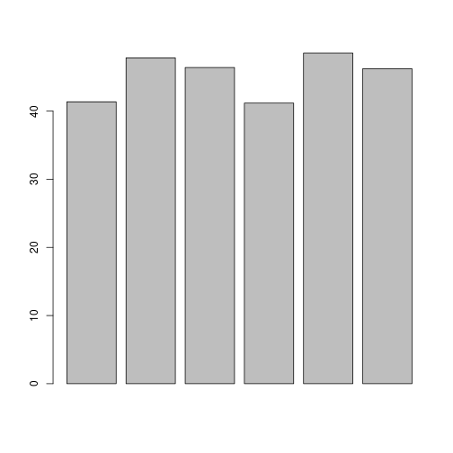
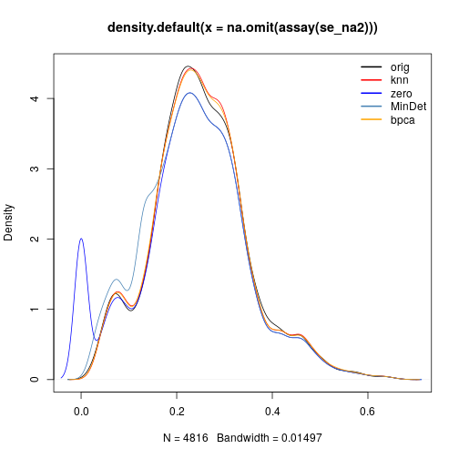
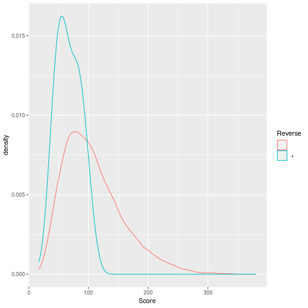
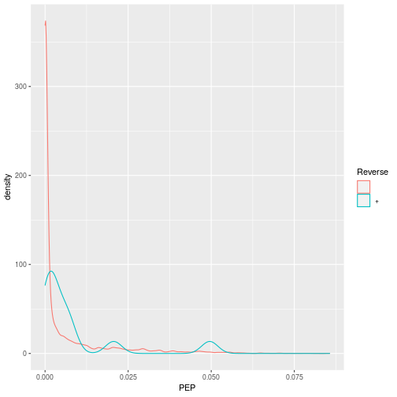

## Contents
{:.no_toc}

-   [Quantitation methodologies](#quantitation-methodologies)
    -   [Label-free MS2: Spectral
        counting](#label-free-ms2-spectral-counting)
    -   [Labelled MS2: Isobaric tagging](#labelled-ms2-isobaric-tagging)
    -   [Label-free MS1: extracted ion
        chromatograms](#label-free-ms1-extracted-ion-chromatograms)
    -   [Labelled MS1: SILAC](#labelled-ms1-silac)
-   [QFeatures](#sec-qf)
    -   [The QFeatures class](#the-qfeatures-class)
    -   [Feature aggregation](#feature-aggregation)
    -   [Subsetting and filtering](#subsetting-and-filtering)
-   [Creating `QFeatures` object](#creating-qfeatures-object)
    -   [Exercise](#exercise)
-   [Analysis pipeline](#analysis-pipeline)
    -   [Missing values](#missing-values)
    -   [Imputation](#imputation)
    -   [Identification quality
        control](#identification-quality-control)
    -   [Creating the QFeatures data](#creating-the-qfeatures-data)
    -   [Filtering out contaminants and reverse
        hits](#filtering-out-contaminants-and-reverse-hits)
    -   [Log-transformation and
        normaliation](#log-transformation-and-normaliation)
    -   [Aggregation](#aggregation)
    -   [Principal component analysis](#principal-component-analysis)
    -   [Visualisation](#visualisation)
    -   [Statistical analysis](#statistical-analysis)
-   [Summary exercice](#summary-exercice)
{:toc} \# Quantitative data {#sec-quant}

### Quantitation methodologies

There are a wide range of proteomics quantitation techniques that can
broadly be classified as labelled vs. label-free, depending on whether
the features are labelled prior the MS acquisition and the MS level at
which quantitation is inferred, namely MS1 or MS2.

<table>
<thead>
<tr class="header">
<th style="text-align: left;"></th>
<th style="text-align: left;">Label-free</th>
<th style="text-align: left;">Labelled</th>
</tr>
</thead>
<tbody>
<tr class="odd">
<td style="text-align: left;">MS1</td>
<td style="text-align: left;">XIC</td>
<td style="text-align: left;">SILAC, 15N</td>
</tr>
<tr class="even">
<td style="text-align: left;">MS2</td>
<td style="text-align: left;">Counting</td>
<td style="text-align: left;">iTRAQ, TMT</td>
</tr>
</tbody>
</table>

#### Label-free MS2: Spectral counting

In spectral counting, one simply counts the number of quantified
peptides that are assigned to a protein.

Spectral counting. Figure from the `Pbase`
package.

#### Labelled MS2: Isobaric tagging

Isobaric tagging refers to the labelling using isobaric tags,
i.e. chemical tags that have the same mass and hence can’t be
distinguished by the spectrometer. The peptides of different samples (4,
6, 10, 11 or 16) are labelled with different tags and combined prior to
mass spectrometry acquisition. Given that they are isobaric, all
identical peptides, irrespective of the tag and this the sample of
origin, are co-analysed, up to fragmentation prior to MS2 analysis.
During fragmentation, the isobaric tags fall of, fragment themselves,
and result in a set of sample specific peaks. These specific peaks can
be used to infer sample-specific quantitation, while the rest of the MS2
spectrum is used for identification.

iTRAQ 4-plex isobaric tagging. Tandem Mass Tags (TMT)
offer up to 16 tags.

#### Label-free MS1: extracted ion chromatograms

In label-free quantitation, the precursor peaks that match an identified
peptide are integrated over retention time and the area under that
*extracted ion chromatogram* is used to quantify that peptide in that
sample.

Label-free quantitation. Figure credit [Johannes
Rainer](https://github.com/jorainer/).

#### Labelled MS1: SILAC

In SILAC quantitation, sample are grown in a medium that contains heavy
amino acids (typically arginine and lysine). All proteins grown in this
*heavy* growth medium contain the heavy form of these amino acids. Two
samples, one grown in heavy medium, and one grown in normal (light)
medium are then combined and analysed together. The heavy peptides
precursor peaks are systematically shifted compared to the light ones,
and the ratio between the height of a heavy and light peaks can be used
to calculate peptide and protein fold-changes.

Silac quantitation. Figure credit Wikimedia
Commons.

These different quantitation techniques come with their respective
benefits and distinct challenges, such as large quantities of raw data
processing, data transformation and normalisation, missing values, and
different underlying statistical models for the quantitative data (count
data for spectral counting, continuous data for the others).

In terms of raw data quantitation in R/Bioconductor, most efforts have
been devoted to MS2-level quantitation. Label-free XIC quantitation has
been addressed in the frame of metabolomics data processing by the
*[xcms](https://bioconductor.org/packages/3.15/xcms)* infrastructure.

Below is a list of suggested packages for some common proteomics
quantitation technologies:

-   Isobaric tagging (iTRAQ and TMT):
    *[MSnbase](https://bioconductor.org/packages/3.15/MSnbase)* and
    *[isobar](https://bioconductor.org/packages/3.15/isobar)*.
-   Label-free: *[xcms](https://bioconductor.org/packages/3.15/xcms)*
    (metabolomics).
-   Counting:
    *[MSnbase](https://bioconductor.org/packages/3.15/MSnbase)* and
    *[MSnID](https://bioconductor.org/packages/3.15/MSnID)* for
    peptide-spectrum matching confidence assessment.
-   *[N14N15](https://github.com/vladpetyuk/N14N15)* for heavy
    Nitrogen-labelled data.

### QFeatures

Mass spectrometry-based quantitative proteomics data can be represented
as a matrix of quantitative values for features (PSMs, peptides,
proteins) arranged along the rows, measured for a set of samples,
arranged along the columns. There is a common representation for such
quantitative data set, namely the `SummarizedExperiment` (SE) \[@SE\]
class:

Schematic representation of the anatomy of a
`SummarizedExperiment` object. (Figure taken from the
`SummarizedExperiment` package vignette.)

-   The sample (columns) metadata can be accessed with the `colData()`
    function.
-   The features (rows) metadata can be accessed with the `rowData()`
    column.
-   If the features represent ranges along genomic coordinates, these
    can be accessed with `rowRanges()`
-   Additional metadata describing the overall experiment can be
    accessed with `metadata()`.
-   The quantitative data can be accessed with `assay()`.
-   `assays()` returns a list of matrix-like assays.

#### The QFeatures class

While mass spectrometers acquire data for spectra/peptides, the
biological entity of interest are the protein. As part of the data
processing, we are thus required to **aggregate** low-level quantitative
features into higher level data.

We are going to start to familiarise ourselves with the `QFeatures`
class implemented in the
[`QFeatures`](https://rformassspectrometry.github.io/QFeatures/articles/QFeatures.html)
package. The class is derived from the Bioconductor
`MultiAssayExperiment` \[@MAE\] (MAE) class. Let’s start by loading the
`QFeatures` package.

    library("QFeatures")

Next, we load the `feat1` test data, which is composed of single *assay*
of class `SummarizedExperiment` composed of 10 rows and 2 columns.

    data(feat1)
    feat1

    ## An instance of class QFeatures containing 1 assays:
    ##  [1] psms: SummarizedExperiment with 10 rows and 2 columns

Let’s perform some simple operations to familiarise ourselves with the
`QFeatures` class:

-   Extract the sample metadata using the `colData()` accessor (like you
    have previously done with `SummarizedExperiment` objects).

<!-- -->

    colData(feat1)

    ## DataFrame with 2 rows and 1 column
    ##        Group
    ##    <integer>
    ## S1         1
    ## S2         2

We can also further annotate the experiment by adding columns to the
`colData` slot:

    colData(feat1)$X <- c("X1", "X2")
    feat1$Y <- c("Y1", "Y2")
    colData(feat1)

    ## DataFrame with 2 rows and 3 columns
    ##        Group           X           Y
    ##    <integer> <character> <character>
    ## S1         1          X1          Y1
    ## S2         2          X2          Y2

-   Extract the first (and only) assay composing this `QFeatures` data
    using the `[[` operator (as you have done to extract elements of a
    list) by using the assay’s index or name.

<!-- -->

    feat1[[1]]

    ## class: SummarizedExperiment 
    ## dim: 10 2 
    ## metadata(0):
    ## assays(1): ''
    ## rownames(10): PSM1 PSM2 ... PSM9 PSM10
    ## rowData names(5): Sequence Protein Var location pval
    ## colnames(2): S1 S2
    ## colData names(0):

    feat1[["psms"]]

    ## class: SummarizedExperiment 
    ## dim: 10 2 
    ## metadata(0):
    ## assays(1): ''
    ## rownames(10): PSM1 PSM2 ... PSM9 PSM10
    ## rowData names(5): Sequence Protein Var location pval
    ## colnames(2): S1 S2
    ## colData names(0):

-   Extract the `psms` assay’s row data and quantitative values.

<!-- -->

    assay(feat1[[1]])

    ##       S1 S2
    ## PSM1   1 11
    ## PSM2   2 12
    ## PSM3   3 13
    ## PSM4   4 14
    ## PSM5   5 15
    ## PSM6   6 16
    ## PSM7   7 17
    ## PSM8   8 18
    ## PSM9   9 19
    ## PSM10 10 20

    rowData(feat1[[1]])

    ## DataFrame with 10 rows and 5 columns
    ##            Sequence     Protein       Var      location      pval
    ##         <character> <character> <integer>   <character> <numeric>
    ## PSM1       SYGFNAAR       ProtA         1 Mitochondr...     0.084
    ## PSM2       SYGFNAAR       ProtA         2 Mitochondr...     0.077
    ## PSM3       SYGFNAAR       ProtA         3 Mitochondr...     0.063
    ## PSM4       ELGNDAYK       ProtA         4 Mitochondr...     0.073
    ## PSM5       ELGNDAYK       ProtA         5 Mitochondr...     0.012
    ## PSM6       ELGNDAYK       ProtA         6 Mitochondr...     0.011
    ## PSM7  IAEESNFPFI...       ProtB         7       unknown     0.075
    ## PSM8  IAEESNFPFI...       ProtB         8       unknown     0.038
    ## PSM9  IAEESNFPFI...       ProtB         9       unknown     0.028
    ## PSM10 IAEESNFPFI...       ProtB        10       unknown     0.097

#### Feature aggregation

The central functionality of the `QFeatures` infrastructure is the
aggregation of features into higher-level features while retaining the
link between the different levels. This can be done with the
[`aggregateFeatures()`
function](https://rformassspectrometry.github.io/QFeatures/reference/QFeatures-aggregate.html).

The call below will

-   operate on the `psms` assay of the `feat1` objects;
-   aggregate the rows of the assay following the grouping defined in
    the `peptides` row data variables;
-   perform aggregation using the `colMeans()` function;
-   create a new assay named `peptides` and add it to the `feat1`
    object.

<!-- -->

    feat1 <- aggregateFeatures(feat1, i = "psms",
                               fcol = "Sequence",
                               name = "peptides",
                               fun = colMeans)
    feat1

    ## An instance of class QFeatures containing 2 assays:
    ##  [1] psms: SummarizedExperiment with 10 rows and 2 columns 
    ##  [2] peptides: SummarizedExperiment with 3 rows and 2 columns

-   Let’s convince ourselves that we understand the effect of feature
    aggregation and repeat the calculations manually and check the
    content of the new assay’s row data.

<!-- -->

    ## SYGFNAAR
    colMeans(assay(feat1[[1]])[1:3, ])

    ## S1 S2 
    ##  2 12

    assay(feat1[[2]])["SYGFNAAR", ]

    ## S1 S2 
    ##  2 12

    ## ELGNDAYK
    colMeans(assay(feat1[[1]])[4:6, ])

    ## S1 S2 
    ##  5 15

    assay(feat1[[2]])["ELGNDAYK", ]

    ## S1 S2 
    ##  5 15

    ## IAEESNFPFIK
    colMeans(assay(feat1[[1]])[7:10, ])

    ##   S1   S2 
    ##  8.5 18.5

    assay(feat1[[2]])["IAEESNFPFIK", ]

    ##   S1   S2 
    ##  8.5 18.5

    rowData(feat1[[2]])

    ## DataFrame with 3 rows and 4 columns
    ##                  Sequence     Protein      location        .n
    ##               <character> <character>   <character> <integer>
    ## ELGNDAYK         ELGNDAYK       ProtA Mitochondr...         3
    ## IAEESNFPFIK IAEESNFPFI...       ProtB       unknown         4
    ## SYGFNAAR         SYGFNAAR       ProtA Mitochondr...         3

We can now aggregate the peptide-level data into a new protein-level
assay using the `colMedians()` aggregation function.

    feat1 <- aggregateFeatures(feat1, i = "peptides",
                               fcol = "Protein",
                               name = "proteins",
                               fun = colMedians)
    feat1

    ## An instance of class QFeatures containing 3 assays:
    ##  [1] psms: SummarizedExperiment with 10 rows and 2 columns 
    ##  [2] peptides: SummarizedExperiment with 3 rows and 2 columns 
    ##  [3] proteins: SummarizedExperiment with 2 rows and 2 columns

    assay(feat1[["proteins"]])

    ##        S1   S2
    ## ProtA 3.5 13.5
    ## ProtB 8.5 18.5

#### Subsetting and filtering

The link between the assays becomes apparent when we now subset the
assays for protein A as shown below or using the `subsetByFeature()`
function. This creates a new instance of class `QFeatures` containing
assays with the expression data for protein, its peptides and their
PSMs.

    feat1["ProtA", , ]

    ## An instance of class QFeatures containing 3 assays:
    ##  [1] psms: SummarizedExperiment with 6 rows and 2 columns 
    ##  [2] peptides: SummarizedExperiment with 2 rows and 2 columns 
    ##  [3] proteins: SummarizedExperiment with 1 rows and 2 columns

The `filterFeatures()` function can be used to filter rows the assays
composing a `QFeatures` object using the row data variables. We can for
example retain rows that have a `pval` &lt; 0.05, which would only keep
rows in the `psms` assay because the `pval` is only relevant for that
assay.

    filterFeatures(feat1, ~ pval < 0.05)

    ## An instance of class QFeatures containing 3 assays:
    ##  [1] psms: SummarizedExperiment with 4 rows and 2 columns 
    ##  [2] peptides: SummarizedExperiment with 0 rows and 2 columns 
    ##  [3] proteins: SummarizedExperiment with 0 rows and 2 columns

On the other hand, if we filter assay rows for those that localise to
the mitochondrion, we retain the relevant protein, peptides and PSMs.

    filterFeatures(feat1, ~ location == "Mitochondrion")

    ## An instance of class QFeatures containing 3 assays:
    ##  [1] psms: SummarizedExperiment with 6 rows and 2 columns 
    ##  [2] peptides: SummarizedExperiment with 2 rows and 2 columns 
    ##  [3] proteins: SummarizedExperiment with 1 rows and 2 columns

As an exercise, let’s filter rows that do not localise to the
mitochondrion.

    filterFeatures(feat1, ~ location != "Mitochondrion")

    ## An instance of class QFeatures containing 3 assays:
    ##  [1] psms: SummarizedExperiment with 4 rows and 2 columns 
    ##  [2] peptides: SummarizedExperiment with 1 rows and 2 columns 
    ##  [3] proteins: SummarizedExperiment with 1 rows and 2 columns

You can refer to the [*Quantitative features for mass spectrometry
data*](https://rformassspectrometry.github.io/QFeatures/articles/QFeatures.html)
vignette and the `QFeatures` [manual
page](https://rformassspectrometry.github.io/QFeatures/reference/QFeatures-class.html)
for more details about the class.

### Creating `QFeatures` object

While `QFeatures` objects can be created manually (see `?QFeatures` for
details), most users will probably possess quantitative data in a
spreadsheet or a dataframe. In such cases, the easiest is to use the
`readQFeatures` function to extract the quantitative data and metadata
columns. Below, we load the `hlpsms` dataframe that contains data for 28
PSMs from the TMT-10plex *hyper*LOPIT spatial proteomics experiment from
\[@Christoforou:2016\]. The `ecol` argument specifies that columns 1 to
10 contain quantitation data, and that the assay should be named `psms`
in the returned `QFeatures` object, to reflect the nature of the data.

    data(hlpsms)
    hl <- readQFeatures(hlpsms, ecol = 1:10, name = "psms")
    hl

    ## An instance of class QFeatures containing 1 assays:
    ##  [1] psms: SummarizedExperiment with 3010 rows and 10 columns

Below, we see that we can extract an assay using its index or its name.
The individual assays are stored as *SummarizedExperiment* object and
further access its quantitative data and metadata using the `assay` and
`rowData` functions.

    hl[[1]]

    ## class: SummarizedExperiment 
    ## dim: 3010 10 
    ## metadata(0):
    ## assays(1): ''
    ## rownames(3010): 1 2 ... 3009 3010
    ## rowData names(18): Sequence ProteinDescriptions ... RTmin markers
    ## colnames(10): X126 X127C ... X130N X131
    ## colData names(0):

    hl[["psms"]]

    ## class: SummarizedExperiment 
    ## dim: 3010 10 
    ## metadata(0):
    ## assays(1): ''
    ## rownames(3010): 1 2 ... 3009 3010
    ## rowData names(18): Sequence ProteinDescriptions ... RTmin markers
    ## colnames(10): X126 X127C ... X130N X131
    ## colData names(0):

    head(assay(hl[["psms"]]))

    ##         X126      X127C       X127N      X128C       X128N      X129C      X129N       X130C      X130N
    ## 1 0.12283431 0.08045915 0.070804055 0.09386901 0.051815695 0.13034383 0.17540095 0.040068658 0.11478839
    ## 2 0.35268185 0.14162381 0.167523880 0.07843497 0.071087436 0.03214548 0.06686260 0.031961793 0.02810434
    ## 3 0.01546089 0.16142297 0.086938133 0.23120844 0.114664348 0.09610188 0.15977819 0.010127118 0.08059400
    ## 4 0.04702854 0.09288723 0.102012167 0.11125409 0.067969116 0.14155358 0.18015910 0.035329902 0.12166589
    ## 5 0.01044693 0.15866147 0.167315736 0.21017494 0.147946673 0.07088253 0.17555789 0.007088253 0.02884754
    ## 6 0.04955362 0.01215244 0.002477681 0.01297833 0.002988949 0.06253195 0.01726511 0.172651119 0.37007905
    ##         X131
    ## 1 0.11961594
    ## 2 0.02957384
    ## 3 0.04370403
    ## 4 0.10014038
    ## 5 0.02307803
    ## 6 0.29732174

    head(rowData(hl[["psms"]]))

    ## DataFrame with 6 rows and 18 columns
    ##      Sequence ProteinDescriptions NbProteins ProteinGroupAccessions Modifications    qValue       PEP  IonScore
    ##   <character>         <character>  <integer>            <character>   <character> <numeric> <numeric> <integer>
    ## 1     SQGEIDk       Tetratrico...          1                 Q8BYY4 K7(TMT6ple...     0.008   0.11800        27
    ## 2     YEAQGDk       Vacuolar p...          1                 P46467 K7(TMT6ple...     0.001   0.01070        27
    ## 3     TTScDTk       C-type man...          1                 Q64449 C4(Carbami...     0.008   0.11800        11
    ## 4     aEELESR       Liprin-alp...          1                 P60469 N-Term(TMT...     0.002   0.04450        24
    ## 5     aQEEAIk       Isoform 2 ...          2               P13597-2 N-Term(Car...     0.001   0.00850        36
    ## 6    dGAVDGcR       Structural...          1                 Q6P5D8 N-Term(TMT...     0.000   0.00322        26
    ##   NbMissedCleavages IsolationInterference IonInjectTimems Intensity    Charge      mzDa      MHDa DeltaMassPPM
    ##           <integer>             <integer>       <integer> <numeric> <integer> <numeric> <numeric>    <numeric>
    ## 1                 0                     0              70    335000         2   503.274   1005.54        -0.38
    ## 2                 0                     0              70    926000         2   520.267   1039.53         0.61
    ## 3                 0                     0              70    159000         2   521.258   1041.51         1.11
    ## 4                 0                     0              70    232000         2   531.785   1062.56         0.35
    ## 5                 0                     0              70    212000         2   537.804   1074.60         1.70
    ## 6                 0                     0              70    865000         2   539.761   1078.51        -0.67
    ##       RTmin       markers
    ##   <numeric>   <character>
    ## 1     24.02       unknown
    ## 2     18.85       unknown
    ## 3     10.17       unknown
    ## 4     29.18       unknown
    ## 5     25.56 Plasma mem...
    ## 6     21.27 Nucleus - ...

For further details on how to manipulate such objects, refer to the
*[MultiAssayExperiment](https://bioconductor.org/packages/3.15/MultiAssayExperiment)*
\[@MAE\] and
*[SummarizedExperiment](https://bioconductor.org/packages/3.15/SummarizedExperiment)*
\[@SE\] packages.

It is also possible to first create a `SummarizedExperiment`, and then
only include it into a `QFeatures` object.

    se <- readSummarizedExperiment(hlpsms, ecol = 1:10)
    se

    ## class: SummarizedExperiment 
    ## dim: 3010 10 
    ## metadata(0):
    ## assays(1): ''
    ## rownames(3010): 1 2 ... 3009 3010
    ## rowData names(18): Sequence ProteinDescriptions ... RTmin markers
    ## colnames(10): X126 X127C ... X130N X131
    ## colData names(0):

    QFeatures(list(psm = se))

    ## An instance of class QFeatures containing 1 assays:
    ##  [1] psm: SummarizedExperiment with 3010 rows and 10 columns

At this stage, i.e. at the beginning of the analysis, and respectively
whether you have a `SummarizedExperiment` or a `QFeatures` object, it is
a good time to define the experimental design in the `colData` slot.

#### Exercise

The CPTAC spike-in study 6 \[@Paulovich:2010\] combines the Sigma UPS1
standard containing 48 different human proteins that are spiked in at 5
different concentrations (conditions A to E) into a constant yeast
protein background. The sample were acquired in triplicate on different
instruments in different labs. We are going to start with a subset of
the CPTAC study 6 containing conditions A and B for a single lab.

The CPTAC spike-in study design (credit Lieven
Clement, statOmics, Ghent University).

The peptide-level data, as processed by MaxQuant \[@Cox:2008\] is
available in the `msdata` package:

    basename(f <- msdata::quant(pattern = "cptac", full.names = TRUE))

    ## [1] "cptac_a_b_peptides.txt"

&#x25BA; Question

Read these data in as either a `SummarizedExperiment` or a `QFeatures`
object and annotated the experiment.

&#x25BA; Solution

From the names of the columns, we see that the quantitative columns,
starting with `"Intensity."` (note the dot!) are at positions 56 to 61.

    names(read.delim(f))

    ##  [1] "Sequence"                 "N.term.cleavage.window"   "C.term.cleavage.window"   "Amino.acid.before"       
    ##  [5] "First.amino.acid"         "Second.amino.acid"        "Second.last.amino.acid"   "Last.amino.acid"         
    ##  [9] "Amino.acid.after"         "A.Count"                  "R.Count"                  "N.Count"                 
    ## [13] "D.Count"                  "C.Count"                  "Q.Count"                  "E.Count"                 
    ## [17] "G.Count"                  "H.Count"                  "I.Count"                  "L.Count"                 
    ## [21] "K.Count"                  "M.Count"                  "F.Count"                  "P.Count"                 
    ## [25] "S.Count"                  "T.Count"                  "W.Count"                  "Y.Count"                 
    ## [29] "V.Count"                  "U.Count"                  "Length"                   "Missed.cleavages"        
    ## [33] "Mass"                     "Proteins"                 "Leading.razor.protein"    "Start.position"          
    ## [37] "End.position"             "Unique..Groups."          "Unique..Proteins."        "Charges"                 
    ## [41] "PEP"                      "Score"                    "Identification.type.6A_7" "Identification.type.6A_8"
    ## [45] "Identification.type.6A_9" "Identification.type.6B_7" "Identification.type.6B_8" "Identification.type.6B_9"
    ## [49] "Experiment.6A_7"          "Experiment.6A_8"          "Experiment.6A_9"          "Experiment.6B_7"         
    ## [53] "Experiment.6B_8"          "Experiment.6B_9"          "Intensity"                "Intensity.6A_7"          
    ## [57] "Intensity.6A_8"           "Intensity.6A_9"           "Intensity.6B_7"           "Intensity.6B_8"          
    ## [61] "Intensity.6B_9"           "Reverse"                  "Potential.contaminant"    "id"                      
    ## [65] "Protein.group.IDs"        "Mod..peptide.IDs"         "Evidence.IDs"             "MS.MS.IDs"               
    ## [69] "Best.MS.MS"               "Oxidation..M..site.IDs"   "MS.MS.Count"

    (i <- grep("Intensity\\.", names(read.delim(f))))

    ## [1] 56 57 58 59 60 61

We now read these data using the `readSummarizedExperiment` function.
This peptide-level expression data will be imported into R as an
instance of class `SummarizedExperiment`. We also use the `fnames`
argument to set the row-names of the `peptides` assay to the peptide
sequences and specify that the file is a tab-separated table.

    cptac_se <- readSummarizedExperiment(f, ecol = i, fnames = "Sequence", sep = "\t")
    cptac_se

    ## class: SummarizedExperiment 
    ## dim: 11466 6 
    ## metadata(0):
    ## assays(1): ''
    ## rownames(11466): AAAAGAGGAGDSGDAVTK AAAALAGGK ... YYTVFDRDNNR YYTVFDRDNNRVGFAEAAR
    ## rowData names(65): Sequence N.term.cleavage.window ... Oxidation..M..site.IDs MS.MS.Count
    ## colnames(6): Intensity.6A_7 Intensity.6A_8 ... Intensity.6B_8 Intensity.6B_9
    ## colData names(0):

Before proceeding, we are going to clean up the sample names and
annotate the experiment:

    colnames(cptac_se) <- sub("I.+\\.", "", colnames(cptac_se))
    cptac_se$condition <- sub("_[7-9]", "", colnames(cptac_se))
    cptac_se$id <- sub("^.+_", "", colnames(cptac_se))
    colData(cptac_se)

    ## DataFrame with 6 rows and 2 columns
    ##        condition          id
    ##      <character> <character>
    ## 6A_7          6A           7
    ## 6A_8          6A           8
    ## 6A_9          6A           9
    ## 6B_7          6B           7
    ## 6B_8          6B           8
    ## 6B_9          6B           9

&#x25BA; Question

There are many row variables that aren’t useful here. Get rid or all of
them but `Sequence`, `Proteins`, `Leading.razor.protein`, `PEP`,
`Score`, `Reverse`, and `Potential.contaminant`.

&#x25BA; Solution

    keep_var <- c("Sequence", "Proteins", "Leading.razor.protein", "PEP",
                  "Score", "Reverse", "Potential.contaminant")

    rowData(cptac_se) <- rowData(cptac_se)[, keep_var]

### Analysis pipeline

A typical quantitative proteomics data processing is composed of the
following steps, which we are going to apply to the cptac data created
above.

-   Data import
-   Exploratory data analysis (PCA)
-   Missing data management (filtering and/or imputation)
-   Data cleaning
-   Transformation and normalisation
-   Aggregation
-   Downstream analysis

<!-- -->

    library("tidyverse")
    library("ggplot2")
    library("QFeatures")
    library("limma")

#### Missing values

Missing values can be highly frequent in proteomics. There are two
reasons supporting the existence of missing values, namely biological or
technical.

1.  Values that are missing due to the absence (or extremely low
    concentration) of a protein are observed for biological reasons, and
    their pattern **aren’t random** (MNAR). A protein missing due to the
    suppression of its expression will not be missing at random: it will
    be missing in the condition in which it was suppressed, and be
    present in the condition where it is expressed.

2.  Due to its data-dependent acquisition, mass spectrometry isn’t
    capable of assaying all peptides in a sample. Peptides that are less
    abundant than some of their co-eluting ions, peptides that do not
    ionise well or peptides that do not get identified might be
    sporadically missing in the final quantitation table, despite their
    presence in the biological samples. Their absence patterns are
    (completely) **random** (MAR or MCAR) in such cases.

Often, third party software that produce quantitative data use zeros
instead of properly reporting missing values. We can use the
`zeroIsNA()` function to replace the `0` by `NA` values in our
`cptac_se` object and then explore the missing data patterns across
columns and rows.

    cptac_se <- zeroIsNA(cptac_se)
    nNA(cptac_se)

    ## $nNA
    ## DataFrame with 1 row and 2 columns
    ##         nNA       pNA
    ##   <integer> <numeric>
    ## 1     31130   45.2497
    ## 
    ## $nNArows
    ## DataFrame with 11466 rows and 3 columns
    ##                name       nNA       pNA
    ##         <character> <integer> <numeric>
    ## 1     AAAAGAGGAG...         4   66.6667
    ## 2         AAAALAGGK         0    0.0000
    ## 3        AAAALAGGKK         0    0.0000
    ## 4     AAADALSDLE...         0    0.0000
    ## 5     AAADALSDLE...         0    0.0000
    ## ...             ...       ...       ...
    ## 11462 YYSIYDLGNN...         6  100.0000
    ## 11463 YYTFNGPNYN...         3   50.0000
    ## 11464    YYTITEVATR         4   66.6667
    ## 11465 YYTVFDRDNN...         6  100.0000
    ## 11466 YYTVFDRDNN...         6  100.0000
    ## 
    ## $nNAcols
    ## DataFrame with 6 rows and 3 columns
    ##          name       nNA       pNA
    ##   <character> <integer> <numeric>
    ## 1        6A_7      4743   41.3658
    ## 2        6A_8      5483   47.8196
    ## 3        6A_9      5320   46.3980
    ## 4        6B_7      4721   41.1739
    ## 5        6B_8      5563   48.5174
    ## 6        6B_9      5300   46.2236

Let’s now explore these missing values:

-   Explore the number or proportion of missing values across peptides
    and samples of the `cptac_se` data.

<!-- -->

    barplot(nNA(cptac_se)$nNAcols$pNA)

    table(nNA(cptac_se)$nNArows$nNA)

    ## 
    ##    0    1    2    3    4    5    6 
    ## 4059  990  884  717  934  807 3075

-   Remove rows that have *too many* missing values. You can do this by
    hand or using the `filterNA()` function.

<!-- -->

    ## remove rows that have 4 or more NAs out of 6
    cptac_se <- filterNA(cptac_se, pNA = 4/6)

#### Imputation

Imputation is the technique of replacing missing data with probable
values. This can be done with `impute()` method. As we have discussed
above, there are however two types of missing values in mass
spectrometry-based proteomics, namely data missing at random (MAR), and
data missing not at random (MNAR). These two types of missing data,
those missing at random, and those missing not at random, need to be
imputed with [different types of imputation
methods](https://rformassspectrometry.github.io/QFeatures/articles/Processing.html#imputation-1)
\[@Lazar:2016\].

Effect of the nature of missing values on their
imputation. Root-mean-square error (RMSE) observations standard
deviation ratio (RSR), KNN and MinDet imputation. Lower (blue) is
better.

Generally, it is recommended to use **hot deck** methods (nearest
neighbour (**left**), maximum likelihood, …) when data are missing at
random.Conversely, MNAR features should ideally be imputed with a
**left-censor** (minimum value (**right**), but not zero, …) method.

There are various methods to perform data imputation, as described in
`?impute`. The *[imp4p](https://CRAN.R-project.org/package=imp4p)*
package contains additional functionality, including some to estimate
the randomness of missing data.

The general syntax for imputation is

    data(se_na2)
    ## impute missing values using knn imputation
    impute(se_na2, method = "knn")

    ## Warning in knnimp(x, k, maxmiss = rowmax, maxp = maxp): 12 rows with more than 50 % entries missing;
    ##  mean imputation used for these rows

    ## class: SummarizedExperiment 
    ## dim: 689 16 
    ## metadata(3): MSnbaseFiles MSnbaseProcessing MSnbaseVersion
    ## assays(1): ''
    ## rownames(689): AT1G09210 AT1G21750 ... AT4G11150 AT4G39080
    ## rowData names(2): nNA randna
    ## colnames(16): M1F1A M1F4A ... M2F8B M2F11B
    ## colData names(1): nNA

&#x25BA; Question

Following the example above, apply a mixed imputation, using knn for
data missing at random and the deterministic minumum left-cencored
imputation for data missing no at random.

&#x25BA; Solution

    impute(se_na2, "mixed",
           randna = rowData(se_na2)$randna,
           mar = "knn", mnar = "MinDet")

    ## class: SummarizedExperiment 
    ## dim: 689 16 
    ## metadata(3): MSnbaseFiles MSnbaseProcessing MSnbaseVersion
    ## assays(1): ''
    ## rownames(689): AT1G09210 AT1G21750 ... AT4G11150 AT4G39080
    ## rowData names(2): nNA randna
    ## colnames(16): M1F1A M1F4A ... M2F8B M2F11B
    ## colData names(1): nNA

&#x25BA; Question

When assessing missing data imputation methods, such as in [Lazar et
al. (2016)](https://pubs.acs.org/doi/abs/10.1021/acs.jproteome.5b00981),
one often replaces values with missing data, imputes these with a method
of choice, then quantifies the difference between original (expected)
and observed (imputed) values. Here, using the `se_na2` data, use this
strategy to assess the difference between knn and Bayesian PCA
imputation.

&#x25BA; Solution

    imp1 <- impute(se_na2, method = "knn")

    ## Warning in knnimp(x, k, maxmiss = rowmax, maxp = maxp): 12 rows with more than 50 % entries missing;
    ##  mean imputation used for these rows

    imp2 <- impute(se_na2, method = "bpca")
    summary(abs(assay(imp1)[is.na(assay(se_na2))] - assay(imp2)[is.na(assay(se_na2))]))

    ##      Min.   1st Qu.    Median      Mean   3rd Qu.      Max. 
    ## 5.332e-05 6.594e-03 1.535e-02 2.315e-02 2.855e-02 2.579e-01

    summary(as.numeric(na.omit(assay(se_na2))))

    ##    Min. 1st Qu.  Median    Mean 3rd Qu.    Max. 
    ##  0.0170  0.1865  0.2440  0.2500  0.3080  0.6587

&#x25BA; Question

When assessing the impact of missing value imputation on real data, one
can’t use the strategy above. Another useful approach is to assess the
impact of the imputation method on the distribution of the quantitative
data. For instance, here is the intensity distribution of the `se_na2`
data. Verify the effect of applying `knn`, `zero`, `MinDet` and `bpca`
on this distribution.

    plot(density(na.omit(assay(se_na2))))

&#x25BA; Solution

    cls <- c("black", "red", "blue", "steelblue", "orange")
    plot(density(na.omit(assay(se_na2))), col = cls[1])
    lines(density(assay(impute(se_na2, method = "knn"))), col = cls[2])

    ## Warning in knnimp(x, k, maxmiss = rowmax, maxp = maxp): 12 rows with more than 50 % entries missing;
    ##  mean imputation used for these rows

    lines(density(assay(impute(se_na2, method = "zero"))), col = cls[3])
    lines(density(assay(impute(se_na2, method = "MinDet"))), col = cls[4])
    lines(density(assay(impute(se_na2, method = "bpca"))), col = cls[5])
    legend("topright", legend = c("orig", "knn", "zero", "MinDet", "bpca"),
           col = cls, lwd = 2, bty = "n")

**Tip**: When downstream analyses permit, it might be safer not to
impute data and deal explicitly with missing values. Indeed missing data
imputation is not a straightforward thing, and is likely to dramatically
fail when a high proportion of data is missing (10s of %). It is
possible to keep NAs when performing hypothesis tests[1], but not to
perform a principal component analysis.

#### Identification quality control

As discussed in the previous chapter, PSMs are deemed relevant after
comparison against hits from a decoy database. The origin of these hits
is recorded with `+` in the `Reverse` variable:

    table(rowData(cptac_se)$Reverse)

    ## 
    ##         + 
    ## 7572   12

Similarly, a proteomics experiment is also searched against a database
of contaminants:

    table(rowData(cptac_se)$Potential.contaminant)

    ## 
    ##         + 
    ## 7558   26

Let’s visualise some of the cptac’s metadata using standard `ggplot2`
code:

&#x25BA; Question

Visualise the identification score and the posterior probability
probability (PEP) distributions from forward and reverse hits and
interpret the figure.

&#x25BA; Solution

    rowData(cptac_se) %>%
        as_tibble() %>%
        ggplot(aes(x = Score, colour = Reverse)) +
        geom_density()

    rowData(cptac_se) %>%
        as_tibble() %>%
        ggplot(aes(x = PEP, colour = Reverse)) +
        geom_density()

#### Creating the QFeatures data

We can now create our `QFeatures` object using the
`SummarizedExperiment` as shown below.

    cptac <- QFeatures(list(peptides = cptac_se))
    cptac

    ## An instance of class QFeatures containing 1 assays:
    ##  [1] peptides: SummarizedExperiment with 7584 rows and 6 columns

We should also assign the `QFeatures` column data with the
`SummarizedExperiment` slot.

    colData(cptac) <- colData(cptac_se)

Note that it is also possible to directly create a `QFeatures` object
with the `readQFeatures()` function and the same arguments as the
`readSummarizedExperiment()` used above. In addition, most functions
used above and below work on single `SummarizedExperiment` objects or
assays within a `QFeatures` object.

#### Filtering out contaminants and reverse hits

&#x25BA; Question

Using the `filterFeatures()` function, filter out the reverse and
contaminant hits, and also retain those that have a posterior error
probability smaller than 0.05.

&#x25BA; Solution

    cptac <-
        cptac %>%
        filterFeatures(~ Reverse != "+") %>%
        filterFeatures(~ Potential.contaminant != "+") %>%
        filterFeatures(~ PEP < 0.05)

#### Log-transformation and normaliation

The two code chunks below log-transform and normalise using the assay
`i` as input and adding a new one names as defined by `name`.

    cptac <- logTransform(cptac, i = "peptides",
                          name = "log_peptides")

&#x25BA; Question

Use the `normalize()` method to normalise the data. The syntax is the
same as `logTransform()`. Use the `center.median` method.

&#x25BA; Solution

    cptac <- normalize(cptac, i = "log_peptides",
                       name = "lognorm_peptides",
                       method = "center.median")

&#x25BA; Question

Visualise the result of the transformations above. The `plotDensities()`
function from the `limma` package is very convenient, but feel free to
use boxplots, violin plots, or any other visualisation that you deem
useful to assess the tranformations.

&#x25BA; Solution

    par(mfrow = c(1, 3))
    limma::plotDensities(assay(cptac[["peptides"]]))
    limma::plotDensities(assay(cptac[["log_peptides"]]))
    limma::plotDensities(assay(cptac[["lognorm_peptides"]]))

#### Aggregation

&#x25BA; Question

Use median aggregation to aggregation peptides into protein values. This
is not necessarily the best choice, as we will see later, but a good
start.

&#x25BA; Solution

    cptac <-
        aggregateFeatures(cptac,
                          "lognorm_peptides",
                          name = "proteins_med",
                          fcol = "Leading.razor.protein",
                          fun = colMedians,
                          na.rm = TRUE)

Looking at the `.n` row variable computed during the aggregation, we see
that most proteins result from the aggregation of 5 peptides or less,
while very few proteins are accounted for by tens of peptides.

    table(rowData(cptac[["proteins_med"]])$.n)

    ## 
    ##   1   2   3   4   5   6   7   8   9  10  11  12  13  14  15  16  17  18  19  20  21  22  23  24  25  26  28  29 
    ## 327 234 167 132  84  73  62  49  49  29  29  24  20  13  15  12   4   6  11   5   7   4   7   2   2   3   1   3 
    ##  30  31  32  34  37  38  39  42  51  52  62 
    ##   1   2   2   1   1   1   1   2   1   1   1

#### Principal component analysis

    library("factoextra")

    pca_pep <-
        cptac[["lognorm_peptides"]] %>%
        filterNA() %>%
        assay() %>%
        t() %>%
        prcomp(scale = TRUE, center = TRUE) %>%
        fviz_pca_ind(habillage = cptac$condition, title = "Peptides")

    pca_prot <-
        cptac[["proteins_med"]] %>%
        filterNA() %>%
        assay() %>%
        t() %>%
        prcomp() %>%
        fviz_pca_ind(habillage = cptac$condition,
                     title = "Proteins (median aggregation)")

    library("patchwork")
    pca_pep + pca_prot

#### Visualisation

Below, we use the `longFormat()` function to extract the quantitative
and row data in a long format, that can be directly reused by the
tidyverse tools.

    longFormat(cptac["P02787ups|TRFE_HUMAN_UPS", ,
                     c("lognorm_peptides", "proteins_med")]) %>%
        as_tibble() %>%
        mutate(condition = ifelse(grepl("A", colname), "A", "B")) %>%
        ggplot(aes(x = colname, y = value, colour = rowname, shape = condition)) +
        geom_point(size = 3) +
        geom_line(aes(group = rowname)) +
        facet_grid(~ assay) +
        ggtitle("P02787ups|TRFE_HUMAN_UPS")

#### Statistical analysis

R in general and Bioconductor in particular are well suited for the
statistical analysis of quantitative proteomics data. Several packages
provide dedicated resources for proteomics data:

-   *[MSstats](https://bioconductor.org/packages/3.15/MSstats)* and
    *[MSstatsTMT](https://bioconductor.org/packages/3.15/MSstatsTMT)*: A
    set of tools for statistical relative protein significance analysis
    in Data dependent (DDA), SRM, Data independent acquisition (DIA) and
    TMT experiments.

-   *[msmsTests](https://bioconductor.org/packages/3.15/msmsTests)*:
    Statistical tests for label-free LC-MS/MS data by spectral counts,
    to discover differentially expressed proteins between two biological
    conditions. Three tests are available: Poisson GLM regression,
    quasi-likelihood GLM regression, and the negative binomial of the
    *[edgeR](https://bioconductor.org/packages/3.15/edgeR)* package. All
    can be readily applied on `MSnSet` instances produced, for example
    by `MSnID`.

-   *[DEP](https://bioconductor.org/packages/3.15/DEP)* provides an
    integrated analysis workflow for the analysis of mass spectrometry
    proteomics data for differential protein expression or differential
    enrichment.

-   *[MSqRob](https://github.com/statOmics/MSqRob)*: The `MSqRob`
    package allows a user to do quantitative protein-level statistical
    inference on LC-MS proteomics data. More specifically, our package
    makes use of peptide-level input data, thus correcting for
    unbalancedness and peptide-specific biases. As previously shown
    ([Goeminne et
    al. (2015)](https://pubs.acs.org/doi/abs/10.1021/pr501223t)), this
    approach is both more sensitive and specific than summarizing
    peptide-level input to protein-level values. Model estimates are
    stabilized by ridge regression, empirical Bayes variance estimation
    and downweighing of outliers. Currently, only label-free proteomics
    data types are supported. `msqrob2` is currently under development
    and will be using `QFeatures` objects.

-   *[proDA](https://github.com/const-ae/proDA)* accounts for missing
    values in label-free mass spectrometry data without imputation. The
    package implements a probabilistic dropout model that ensures that
    the information from observed and missing values are properly
    combined. It adds empirical Bayesian priors to increase power to
    detect differentially abundant proteins.

Others, while not specfic to proteomics, are also recommended, such as
the *[limma](https://bioconductor.org/packages/3.15/limma)* package.
When analysing spectral counting data, methods for high throughput
sequencing data are applicable. Below, we illustrate how to apply a
typical `edgeR` test to count data using the `msms.edgeR` function from
the `msmsTests` package.

Below, we are going to perform our statistical analysis on the protein
data using `limma`.

    prots <- cptac[["proteins_med"]]
    colData(prots) <- colData(cptac)

The *[limma](https://bioconductor.org/packages/3.15/limma)* package is
the precursor package that enables the consistent application of linear
models to normalliy distributed omics data in general, and microarrays
in particular.

The `limma` package implements an empirical Bayes method that borrows
information across features to estimate the standard error and calculate
(so called moderated) t statistics. This approach is demonstrably more
powerful that a standard t-tests when the number of samples is low.

The code chunk below illustrates how to set up the model, fit it, and
apply the empirical Bayes moderation.

    library("limma")
    design <- model.matrix(~ prots$condition)
    fit <- lmFit(assay(prots), design)

    ## Warning: Partial NA coefficients for 25 probe(s)

    fit <- eBayes(fit)

Finally, the `topTable()` function is used the extract the results for
the coefficient of interest.

    res <-
        topTable(fit, coef = "prots$condition6B", number = Inf) %>%
        rownames_to_column("protein") %>%
        as_tibble() %>%
        mutate(TP = grepl("ups", protein))

Note the warning about partial `NA` coefficients for 23 probes:

    na_coefs <-
        filter(res, is.na(t)) %>%
        pull(protein)
    assay(prots[na_coefs, ])

    ##                                6A_7      6A_8       6A_9       6B_7       6B_8       6B_9
    ## P00167ups|CYB5_HUMAN_UPS        NaN       NaN        NaN -0.7840558 -2.0282987 -1.1230809
    ## P01112ups|RASH_HUMAN_UPS        NaN       NaN        NaN -1.5564896        NaN -1.5618192
    ## P05413ups|FABPH_HUMAN_UPS       NaN       NaN        NaN -3.3419480        NaN -3.8907081
    ## P08758ups|ANXA5_HUMAN_UPS       NaN       NaN        NaN -2.7973872 -2.0137585 -2.0894752
    ## sp|P06704|CDC31_YEAST           NaN       NaN        NaN -1.2032046 -2.1252371 -1.5844104
    ## sp|P25574|EMC1_YEAST      -1.506177 -1.983737 -0.7795009        NaN        NaN        NaN
    ## sp|P32608|RTG2_YEAST            NaN       NaN        NaN        NaN -4.4424189 -2.7873186
    ## sp|P32769|HBS1_YEAST            NaN -1.384031 -0.7285780        NaN        NaN        NaN
    ## sp|P34217|PIN4_YEAST            NaN       NaN        NaN -0.8378614 -0.1316397 -0.1989392
    ## sp|P34237|CASP_YEAST            NaN       NaN        NaN -1.5645172 -1.6600291 -1.6877463
    ## sp|P38166|SFT2_YEAST      -1.585685 -1.076707        NaN        NaN        NaN        NaN
    ## sp|P40056|GET2_YEAST            NaN -1.091696 -1.4014211        NaN        NaN        NaN
    ## sp|P40533|TED1_YEAST            NaN       NaN        NaN -2.0491876        NaN -1.7474812
    ## sp|P43582|WWM1_YEAST            NaN       NaN        NaN -0.5538711 -0.7360990 -0.7207043
    ## sp|P46965|SPC1_YEAST            NaN -3.428771 -3.6321984        NaN        NaN        NaN
    ## sp|P48363|PFD3_YEAST            NaN       NaN        NaN -0.1904905        NaN -0.5087747
    ## sp|P53044|UFD1_YEAST            NaN       NaN        NaN -2.3937896 -1.5138746        NaN
    ## sp|P53091|MCM6_YEAST            NaN -1.253779 -1.6910302        NaN        NaN        NaN
    ## sp|P53115|INO80_YEAST           NaN       NaN        NaN -2.7183960        NaN -2.7504079
    ## sp|P53893|RIA1_YEAST      -1.830856       NaN -1.5232812        NaN        NaN        NaN
    ## sp|Q05029|BCH1_YEAST      -1.857855 -1.760501        NaN        NaN        NaN        NaN
    ## sp|Q07540|FRDA_YEAST            NaN       NaN        NaN -2.3850242        NaN -2.0325180
    ## sp|Q08645|FOLE_YEAST            NaN       NaN        NaN -1.7269184        NaN -1.5257358
    ## sp|Q12255|NYV1_YEAST            NaN       NaN        NaN -2.8706030        NaN -2.8237317
    ## sp|Q12280|IQG1_YEAST            NaN       NaN        NaN -2.5636389 -2.0547564 -2.4648042

We can now visualise the results using a volcano plot:

    res %>%
        ggplot(aes(x = logFC, y = -log10(adj.P.Val))) +
        geom_point(aes(colour = TP)) +
        geom_vline(xintercept = c(-1, 1)) +
        geom_hline(yintercept = -log10(0.05)) +
        scale_color_manual(values = c("black","red"))

    ## Warning: Removed 25 rows containing missing values (geom_point).

Using the pipeline described above, we would would identify a single
differentially expressed protein at an 5 percent FDR but miss out the
other 36 expected spike-in proteins.

We can assess our results in terms of true/false postitves/negatives:

-   True positives: 1
-   False positives: 0
-   True negatives: 1330
-   False negatives: 32

### Summary exercice

As shown below, it is possible to substantially improve these results by
aggregating features using a robust summarisation (available as
`MsCoreUtils::robustSummary()`), i.e robust regression with M-estimation
using Huber weights, as described in section 2.7 in \[@Sticker:2019\].

-   True positives: 21
-   False positives: 2
-   True negatives: 1340
-   False negatives: 12

Repeat and adapt what we have seen here using, for example, the
`robustSummary()` function.

[1] Still, it is recommended to explore missingness as part of the
exploratory data analysis.
