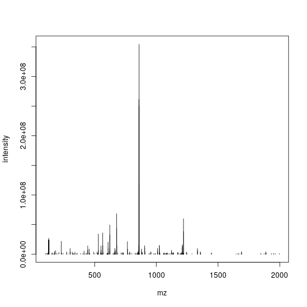
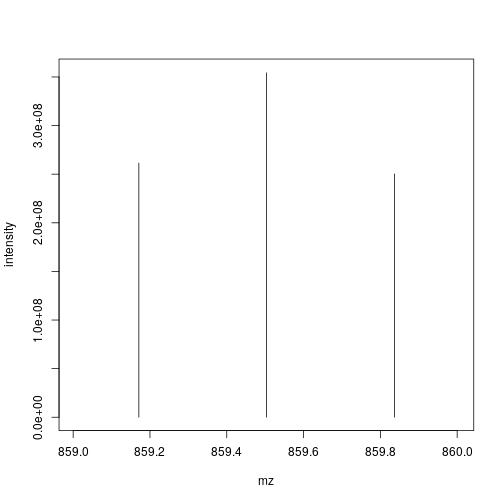
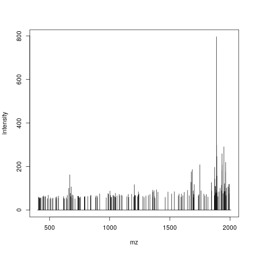

## Contents
{:.no_toc}

-   [Raw MS data under the hood: the `mzR` package](#sec-raw2)
-   [PSM data under the hood](#sec-id2)
    -   [`mzID`](#mzid)
    -   [`mzR`](#mzr)
{:toc} \# Annex {#sec-anx}

### Raw MS data under the hood: the `mzR` package

The `mzR` package is a direct interface to the
[proteowizard](http://proteowizard.sourceforge.net/) code base. It
includes a substantial proportion of *pwiz*’s C/C++ code for fast and
efficient parsing of these large raw data files.

Let’s start by using some raw data files from the `msdata` package.
After loading it, we use the `proteomics()` function to return the full
file names for two raw data files. We will start by focusing on the
second one.

    f <- msdata::proteomics(full.names = TRUE)
    f

    ## [1] "/usr/local/lib/R/site-library/msdata/proteomics/MRM-standmix-5.mzML.gz"                                                
    ## [2] "/usr/local/lib/R/site-library/msdata/proteomics/MS3TMT10_01022016_32917-33481.mzML.gz"                                 
    ## [3] "/usr/local/lib/R/site-library/msdata/proteomics/MS3TMT11.mzML"                                                         
    ## [4] "/usr/local/lib/R/site-library/msdata/proteomics/TMT_Erwinia_1uLSike_Top10HCD_isol2_45stepped_60min_01-20141210.mzML.gz"
    ## [5] "/usr/local/lib/R/site-library/msdata/proteomics/TMT_Erwinia_1uLSike_Top10HCD_isol2_45stepped_60min_01.mzML.gz"

    (f2 <- grep("20141210", f, value = TRUE))

    ## [1] "/usr/local/lib/R/site-library/msdata/proteomics/TMT_Erwinia_1uLSike_Top10HCD_isol2_45stepped_60min_01-20141210.mzML.gz"

The three main functions of `mzR` are

-   `openMSfile` to create a file handle to a raw data file
-   `header` to extract metadata about the spectra contained in the file
-   `peaks` to extract one or multiple spectra of interest.

Other functions such as `instrumentInfo`, or `runInfo` can be used to
gather general information about a run.

    library("mzR")
    ms <- openMSfile(f2)
    ms

    ## Mass Spectrometry file handle.
    ## Filename:  TMT_Erwinia_1uLSike_Top10HCD_isol2_45stepped_60min_01-20141210.mzML.gz 
    ## Number of scans:  7534

    hd <- header(ms)
    dim(hd)

    ## [1] 7534   31

    names(hd)

    ##  [1] "seqNum"                     "acquisitionNum"             "msLevel"                   
    ##  [4] "polarity"                   "peaksCount"                 "totIonCurrent"             
    ##  [7] "retentionTime"              "basePeakMZ"                 "basePeakIntensity"         
    ## [10] "collisionEnergy"            "ionisationEnergy"           "lowMZ"                     
    ## [13] "highMZ"                     "precursorScanNum"           "precursorMZ"               
    ## [16] "precursorCharge"            "precursorIntensity"         "mergedScan"                
    ## [19] "mergedResultScanNum"        "mergedResultStartScanNum"   "mergedResultEndScanNum"    
    ## [22] "injectionTime"              "filterString"               "spectrumId"                
    ## [25] "centroided"                 "ionMobilityDriftTime"       "isolationWindowTargetMZ"   
    ## [28] "isolationWindowLowerOffset" "isolationWindowUpperOffset" "scanWindowLowerLimit"      
    ## [31] "scanWindowUpperLimit"

    head(peaks(ms, 117))

    ##            mz intensity
    ## [1,] 399.9976         0
    ## [2,] 399.9991         0
    ## [3,] 400.0006         0
    ## [4,] 400.0021         0
    ## [5,] 400.2955         0
    ## [6,] 400.2970         0

    str(peaks(ms, 1:5))

    ## List of 5
    ##  $ : num [1:25800, 1:2] 400 400 400 400 400 ...
    ##   ..- attr(*, "dimnames")=List of 2
    ##   .. ..$ : NULL
    ##   .. ..$ : chr [1:2] "mz" "intensity"
    ##  $ : num [1:25934, 1:2] 400 400 400 400 400 ...
    ##   ..- attr(*, "dimnames")=List of 2
    ##   .. ..$ : NULL
    ##   .. ..$ : chr [1:2] "mz" "intensity"
    ##  $ : num [1:26148, 1:2] 400 400 400 400 400 ...
    ##   ..- attr(*, "dimnames")=List of 2
    ##   .. ..$ : NULL
    ##   .. ..$ : chr [1:2] "mz" "intensity"
    ##  $ : num [1:26330, 1:2] 400 400 400 400 400 ...
    ##   ..- attr(*, "dimnames")=List of 2
    ##   .. ..$ : NULL
    ##   .. ..$ : chr [1:2] "mz" "intensity"
    ##  $ : num [1:26463, 1:2] 400 400 400 400 400 ...
    ##   ..- attr(*, "dimnames")=List of 2
    ##   .. ..$ : NULL
    ##   .. ..$ : chr [1:2] "mz" "intensity"

&#x25BA; Question

Let’s extract the index of the MS2 spectrum with the highest base peak
intensity and plot its spectrum. Is the data centroided or in profile
mode?

&#x25BA; Solution

    hd2 <- hd[hd$msLevel == 2, ]
    i <- which.max(hd2$basePeakIntensity)
    hd2[i, ]

    ##      seqNum acquisitionNum msLevel polarity peaksCount totIonCurrent retentionTime basePeakMZ basePeakIntensity
    ## 5404   5404           5404       2        1        275    2283283712      2751.313   859.5032         354288224
    ##      collisionEnergy ionisationEnergy    lowMZ  highMZ precursorScanNum precursorMZ precursorCharge
    ## 5404              45                0 100.5031 1995.63             5403    859.1722               3
    ##      precursorIntensity mergedScan mergedResultScanNum mergedResultStartScanNum mergedResultEndScanNum
    ## 5404          627820480         NA                  NA                       NA                     NA
    ##      injectionTime                                             filterString
    ## 5404    0.03474091 FTMS + p NSI d Full ms2 859.50@hcd45.00 [100.00-2000.00]
    ##                                         spectrumId centroided ionMobilityDriftTime isolationWindowTargetMZ
    ## 5404 controllerType=0 controllerNumber=1 scan=5404       TRUE                   NA                   859.5
    ##      isolationWindowLowerOffset isolationWindowUpperOffset scanWindowLowerLimit scanWindowUpperLimit
    ## 5404                          1                          1                  100                 2000

    pi <- peaks(ms, hd2[i, 1])
    plot(pi, type = "h")

    mz <- hd2[i, "basePeakMZ"]
    plot(pi, type = "h", xlim = c(mz - 0.5, mz + 0.5))

&#x25BA; Question

Pick an MS1 spectrum and visually check whether it is centroided or in
profile mode.

&#x25BA; Solution

    ## Zooming into spectrum 300 (an MS1 spectrum).
    j <- 300
    pj <- peaks(ms, j)
    plot(pj, type = "l")

    mz <- hd[j, "basePeakMZ"]
    plot(pj, type = "l", xlim = c(mz - 0.5, mz + 0.5))

### PSM data under the hood

There are two packages that can be used to parse `mzIdentML` files,
namely `mzR` (that we have already used for raw data) and `mzID`. The
major difference is that the former leverages C++ code from
`proteowizard` and is hence faster than the latter (which uses the `XML`
R package). They both work in similar ways.

    |Data type      |File format |Data structure |Package |
    |:--------------|:-----------|:--------------|:-------|
    |Identification |mzIdentML   |mzRident       |mzR     |
    |Identification |mzIdentML   |mzID           |mzID    |

Which of these packages is used by `PSM()` can be defined by the
`parser` argument, as documented in `?PSM`.

#### `mzID`

The main functions are `mzID` to read the data into a dedicated data
class and `flatten` to transform it into a `data.frame`.

    idf

    ## [1] "/usr/local/lib/R/site-library/msdata/ident/TMT_Erwinia_1uLSike_Top10HCD_isol2_45stepped_60min_01-20141210.mzid"

    library("mzID")

    ## 
    ## Attaching package: 'mzID'

    ## The following object is masked from 'package:purrr':
    ## 
    ##     flatten

    ## The following object is masked from 'package:dplyr':
    ## 
    ##     id

    id <- mzID(idf)

    ## reading TMT_Erwinia_1uLSike_Top10HCD_isol2_45stepped_60min_01-20141210.mzid... DONE!

    id

    ## An mzID object
    ## 
    ## Software used:   MS-GF+ (version: Beta (v10072))
    ## 
    ## Rawfile:         /home/lg390/dev/01_svn/workflows/proteomics/TMT_Erwinia_1uLSike_Top10HCD_isol2_45stepped_60min_01-20141210.mzML
    ## 
    ## Database:        /home/lg390/dev/01_svn/workflows/proteomics/erwinia_carotovora.fasta
    ## 
    ## Number of scans: 5343
    ## Number of PSM's: 5656

Various data can be extracted from the `mzID` object, using one of the
accessor functions such as `database`, `software`, `scans`, `peptides`,
… The object can also be converted into a `data.frame` using the
`flatten` function.

    head(flatten(id))

    ##                                      spectrumid scan number(s) acquisitionnum passthreshold rank
    ## 1 controllerType=0 controllerNumber=1 scan=5782           5782           5782          TRUE    1
    ## 2 controllerType=0 controllerNumber=1 scan=6037           6037           6037          TRUE    1
    ## 3 controllerType=0 controllerNumber=1 scan=5235           5235           5235          TRUE    1
    ## 4 controllerType=0 controllerNumber=1 scan=5397           5397           5397          TRUE    1
    ## 5 controllerType=0 controllerNumber=1 scan=6075           6075           6075          TRUE    1
    ## 6 controllerType=0 controllerNumber=1 scan=5761           5761           5761          TRUE    1
    ##   calculatedmasstocharge experimentalmasstocharge chargestate ms-gf:denovoscore ms-gf:evalue ms-gf:pepqvalue
    ## 1              1080.2321                1080.2325           3               174 1.086033e-20               0
    ## 2              1002.2115                1002.2089           3               245 1.988774e-19               0
    ## 3              1189.2800                1189.2836           3               264 5.129649e-19               0
    ## 4               960.5365                 960.5365           3               178 5.163566e-18               0
    ## 5              1264.3419                1264.3409           3               252 4.356914e-17               0
    ## 6              1268.6501                1268.6429           2               138 4.658952e-17               0
    ##   ms-gf:qvalue ms-gf:rawscore ms-gf:specevalue assumeddissociationmethod isotopeerror isdecoy post pre end start
    ## 1            0            147     3.764831e-27                       HCD            0   FALSE    S   R  84    50
    ## 2            0            214     6.902626e-26                       HCD            0   FALSE    R   K 315   288
    ## 3            0            211     1.778789e-25                       HCD            0   FALSE    A   R 224   192
    ## 4            0            154     1.792541e-24                       HCD            0   FALSE    -   R 290   264
    ## 5            0            188     1.510364e-23                       HCD            0   FALSE    F   R 153   119
    ## 6            0            123     1.618941e-23                       HCD            0   FALSE    Y   K 286   264
    ##   accession length                                       description                              pepseq modified
    ## 1   ECA1932    155                        outer membrane lipoprotein PVQIQAGEDSNVIGALGGAVLGGFLGNTIGGGSGR    FALSE
    ## 2   ECA1147    434                                    trigger factor        TQVLDGLINANDIEVPVALIDGEIDVLR    FALSE
    ## 3   ECA0013    295                ribose-binding periplasmic protein   TKGLNVMQNLLTAHPDVQAVFAQNDEMALGALR    FALSE
    ## 4   ECA1731    290                                         flagellin         SQILQQAGTSVLSQANQVPQTVLSLLR    FALSE
    ## 5   ECA1443    298      UTP--glucose-1-phosphate uridylyltransferase PIIGDNPFVVVLPDVVLDESTADQTQENLALLISR    FALSE
    ## 6   ECA1444    468 6-phosphogluconate dehydrogenase, decarboxylating             WTSQSSLDLGEPLSLITESVFAR    FALSE
    ##   modification                                                              idFile
    ## 1         <NA> TMT_Erwinia_1uLSike_Top10HCD_isol2_45stepped_60min_01-20141210.mzid
    ## 2         <NA> TMT_Erwinia_1uLSike_Top10HCD_isol2_45stepped_60min_01-20141210.mzid
    ## 3         <NA> TMT_Erwinia_1uLSike_Top10HCD_isol2_45stepped_60min_01-20141210.mzid
    ## 4         <NA> TMT_Erwinia_1uLSike_Top10HCD_isol2_45stepped_60min_01-20141210.mzid
    ## 5         <NA> TMT_Erwinia_1uLSike_Top10HCD_isol2_45stepped_60min_01-20141210.mzid
    ## 6         <NA> TMT_Erwinia_1uLSike_Top10HCD_isol2_45stepped_60min_01-20141210.mzid
    ##                                                          spectrumFile             databaseFile
    ## 1 TMT_Erwinia_1uLSike_Top10HCD_isol2_45stepped_60min_01-20141210.mzML erwinia_carotovora.fasta
    ## 2 TMT_Erwinia_1uLSike_Top10HCD_isol2_45stepped_60min_01-20141210.mzML erwinia_carotovora.fasta
    ## 3 TMT_Erwinia_1uLSike_Top10HCD_isol2_45stepped_60min_01-20141210.mzML erwinia_carotovora.fasta
    ## 4 TMT_Erwinia_1uLSike_Top10HCD_isol2_45stepped_60min_01-20141210.mzML erwinia_carotovora.fasta
    ## 5 TMT_Erwinia_1uLSike_Top10HCD_isol2_45stepped_60min_01-20141210.mzML erwinia_carotovora.fasta
    ## 6 TMT_Erwinia_1uLSike_Top10HCD_isol2_45stepped_60min_01-20141210.mzML erwinia_carotovora.fasta

#### `mzR`

The `mzR` interface provides a similar interface. It is however much
faster as it does not read all the data into memory and only extracts
relevant data on demand. It has also accessor functions such as
`softwareInfo`, `mzidInfo`, … (use
`showMethods(classes = "mzRident", where = "package:mzR")`) to see all
available methods.

    library("mzR")
    id2 <- openIDfile(idf)
    id2

    ## Identification file handle.
    ## Filename:  TMT_Erwinia_1uLSike_Top10HCD_isol2_45stepped_60min_01-20141210.mzid 
    ## Number of psms:  5759

    softwareInfo(id2)

    ## [1] "MS-GF+ Beta (v10072) "                         "ProteoWizard MzIdentML 3.0.21263 ProteoWizard"

The identification data can be accessed as a `data.frame` with the
`psms` accessor.

    head(psms(id2))

    ##                                      spectrumID chargeState rank passThreshold experimentalMassToCharge
    ## 1 controllerType=0 controllerNumber=1 scan=5782           3    1          TRUE                1080.2325
    ## 2 controllerType=0 controllerNumber=1 scan=6037           3    1          TRUE                1002.2089
    ## 3 controllerType=0 controllerNumber=1 scan=5235           3    1          TRUE                1189.2836
    ## 4 controllerType=0 controllerNumber=1 scan=5397           3    1          TRUE                 960.5365
    ## 5 controllerType=0 controllerNumber=1 scan=6075           3    1          TRUE                1264.3409
    ## 6 controllerType=0 controllerNumber=1 scan=5761           2    1          TRUE                1268.6429
    ##   calculatedMassToCharge                            sequence peptideRef modNum isDecoy post pre start end
    ## 1              1080.2321 PVQIQAGEDSNVIGALGGAVLGGFLGNTIGGGSGR       Pep1      0   FALSE    S   R    50  84
    ## 2              1002.2115        TQVLDGLINANDIEVPVALIDGEIDVLR       Pep2      0   FALSE    R   K   288 315
    ## 3              1189.2800   TKGLNVMQNLLTAHPDVQAVFAQNDEMALGALR       Pep3      0   FALSE    A   R   192 224
    ## 4               960.5365         SQILQQAGTSVLSQANQVPQTVLSLLR       Pep4      0   FALSE    -   R   264 290
    ## 5              1264.3419 PIIGDNPFVVVLPDVVLDESTADQTQENLALLISR       Pep5      0   FALSE    F   R   119 153
    ## 6              1268.6501             WTSQSSLDLGEPLSLITESVFAR       Pep6      0   FALSE    Y   K   264 286
    ##   DatabaseAccess DBseqLength DatabaseSeq                                       DatabaseDescription scan.number.s.
    ## 1        ECA1932         155                                    ECA1932 outer membrane lipoprotein           5782
    ## 2        ECA1147         434                                                ECA1147 trigger factor           6037
    ## 3        ECA0013         295                            ECA0013 ribose-binding periplasmic protein           5235
    ## 4        ECA1731         290                                                     ECA1731 flagellin           5397
    ## 5        ECA1443         298                  ECA1443 UTP--glucose-1-phosphate uridylyltransferase           6075
    ## 6        ECA1444         468             ECA1444 6-phosphogluconate dehydrogenase, decarboxylating           5761
    ##   acquisitionNum
    ## 1           5782
    ## 2           6037
    ## 3           5235
    ## 4           5397
    ## 5           6075
    ## 6           5761
